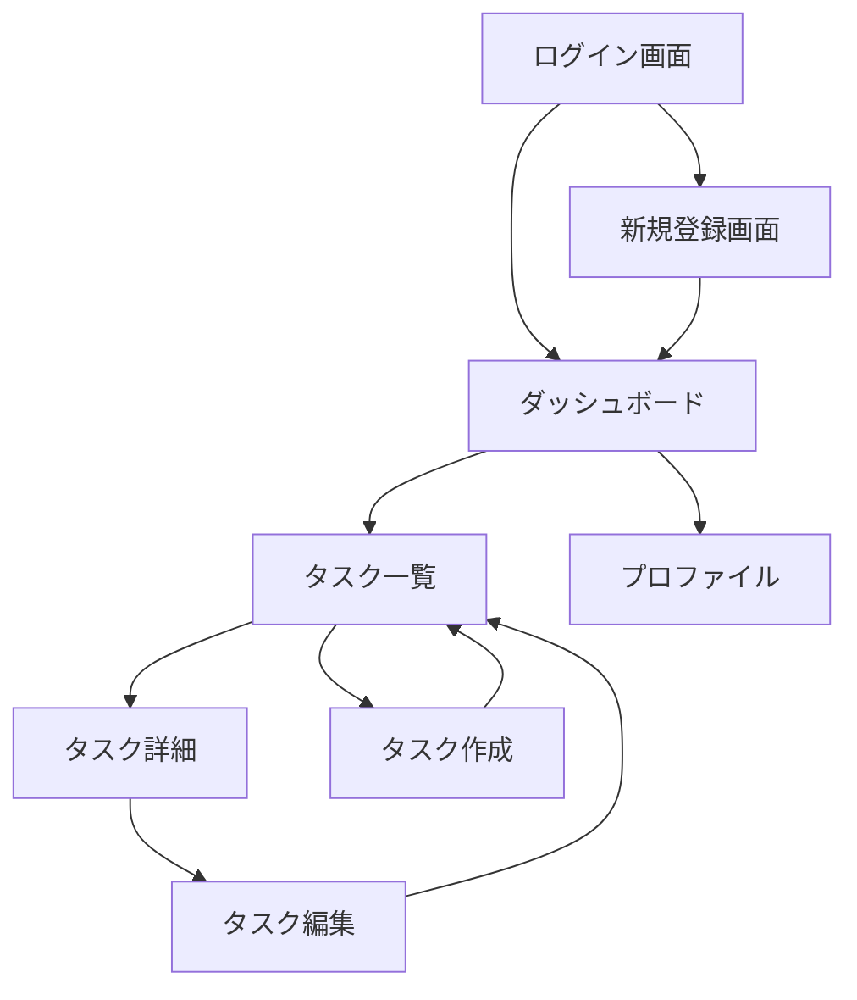

# 要件定義書 - タスク管理アプリ

## 機能要件詳細

### 1. ユーザー管理機能

#### 1.1 ユーザー登録
- **入力項目**:
  - メールアドレス（必須、Email形式）
  - パスワード（必須、8文字以上）
  - 名前（必須、50文字以内）
- **処理**:
  1. 入力値のバリデーション
  2. メールアドレスの重複チェック
  3. パスワードのハッシュ化
  4. DBへの保存
- **出力**: 登録完了メッセージ、自動ログイン

#### 1.2 ユーザーログイン
- **入力項目**:
  - メールアドレス（必須）
  - パスワード（必須）
- **処理**:
  1. 認証情報の検証
  2. JWTトークンの生成
  3. セッション管理
- **出力**: 認証トークン、ダッシュボードへリダイレクト

#### 1.3 ユーザープロファイル
- **機能**:
  - プロファイル情報の表示
  - プロファイル情報の編集
  - パスワード変更
- **項目**: 名前、メールアドレス、作成日、最終ログイン日

### 2. タスク管理機能

#### 2.1 タスク作成
- **入力項目**:
  - タイトル（必須、100文字以内）
  - 説明（任意、500文字以内）
  - 優先度（高・中・低）
  - 期限（任意）
  - カテゴリ（任意）
- **処理**:
  1. 入力値のバリデーション
  2. ユーザーIDの設定
  3. DBへの保存
- **出力**: 作成完了メッセージ、タスク一覧への追加

#### 2.2 タスク一覧表示
- **機能**:
  - 全タスクの一覧表示
  - フィルター機能（ステータス、優先度、カテゴリ）
  - ソート機能（作成日、期限、優先度）
  - ページネーション（20件/ページ）
- **表示項目**: タイトル、ステータス、優先度、期限、作成日

#### 2.3 タスク詳細表示
- **機能**:
  - タスクの詳細情報表示
  - タスクの編集ボタン
  - タスクの削除ボタン
- **表示項目**: 全タスク情報、作成日、更新日

#### 2.4 タスク編集
- **機能**: タスク作成と同じ項目の編集
- **処理**:
  1. 権限チェック（自分のタスクのみ）
  2. 入力値のバリデーション
  3. DBの更新
- **出力**: 更新完了メッセージ

#### 2.5 タスク削除
- **機能**: タスクの論理削除
- **処理**:
  1. 権限チェック（自分のタスクのみ）
  2. 削除確認ダイアログ
  3. 論理削除フラグの設定
- **出力**: 削除完了メッセージ

#### 2.6 タスクステータス管理
- **ステータス**: 未着手、進行中、完了、保留
- **機能**:
  - ドラッグ&ドロップでのステータス変更
  - ワンクリックでのステータス変更
  - ステータス変更履歴の記録

### 3. ダッシュボード機能

#### 3.1 統計情報表示
- **機能**:
  - 総タスク数
  - ステータス別タスク数
  - 今日の期限タスク数
  - 完了率の表示
- **グラフ**: 円グラフ、棒グラフでの可視化

#### 3.2 最近のタスク
- **機能**: 最近作成/更新されたタスクの表示（最大10件）
- **表示項目**: タイトル、ステータス、更新日

## データモデル

### User テーブル
```sql
CREATE TABLE users (
    id SERIAL PRIMARY KEY,
    email VARCHAR(255) UNIQUE NOT NULL,
    password_hash VARCHAR(255) NOT NULL,
    name VARCHAR(50) NOT NULL,
    created_at TIMESTAMP DEFAULT CURRENT_TIMESTAMP,
    updated_at TIMESTAMP DEFAULT CURRENT_TIMESTAMP
);
```

### Task テーブル
```sql
CREATE TABLE tasks (
    id SERIAL PRIMARY KEY,
    user_id INTEGER REFERENCES users(id) ON DELETE CASCADE,
    title VARCHAR(100) NOT NULL,
    description TEXT,
    status VARCHAR(20) DEFAULT '未着手' CHECK (status IN ('未着手', '進行中', '完了', '保留')),
    priority VARCHAR(10) DEFAULT '中' CHECK (priority IN ('高', '中', '低')),
    category VARCHAR(50),
    due_date DATE,
    created_at TIMESTAMP DEFAULT CURRENT_TIMESTAMP,
    updated_at TIMESTAMP DEFAULT CURRENT_TIMESTAMP,
    deleted_at TIMESTAMP NULL
);
```

## API仕様

### 認証API
| メソッド | パス | 説明 | 認証 |
|---------|------|------|------|
| POST | /api/auth/register | ユーザー登録 | 不要 |
| POST | /api/auth/login | ログイン | 不要 |
| POST | /api/auth/logout | ログアウト | 必要 |
| GET | /api/auth/profile | プロファイル取得 | 必要 |
| PUT | /api/auth/profile | プロファイル更新 | 必要 |

### タスクAPI
| メソッド | パス | 説明 | 認証 |
|---------|------|------|------|
| GET | /api/tasks | タスク一覧取得 | 必要 |
| POST | /api/tasks | タスク作成 | 必要 |
| GET | /api/tasks/:id | タスク詳細取得 | 必要 |
| PUT | /api/tasks/:id | タスク更新 | 必要 |
| DELETE | /api/tasks/:id | タスク削除 | 必要 |
| PATCH | /api/tasks/:id/status | ステータス更新 | 必要 |

### ダッシュボードAPI
| メソッド | パス | 説明 | 認証 |
|---------|------|------|------|
| GET | /api/dashboard/stats | 統計情報取得 | 必要 |
| GET | /api/dashboard/recent | 最近のタスク取得 | 必要 |

## 画面遷移


## エラー処理
| エラーコード | 説明 | 対処法 |
|------------|------|--------|
| E001 | メールアドレス重複 | 別のメールアドレスを使用 |
| E002 | 認証エラー | ログイン情報を確認 |
| E003 | 権限エラー | 自分のタスクのみ操作可能 |
| E004 | バリデーションエラー | 入力値を確認 |

## 非機能要件
- レスポンスタイム: 95%が1秒以内
- 可用性: 99.9%
- セキュリティ: JWT認証、HTTPS必須
- データバックアップ: 日次
- ブラウザ対応: Chrome, Firefox, Safari最新版
- モバイル対応: レスポンシブデザイン

## 次のステップ
1. この要件に基づいてプロトタイプを実装
2. 動作確認と要件の妥当性検証
3. UI/UXの詳細設計