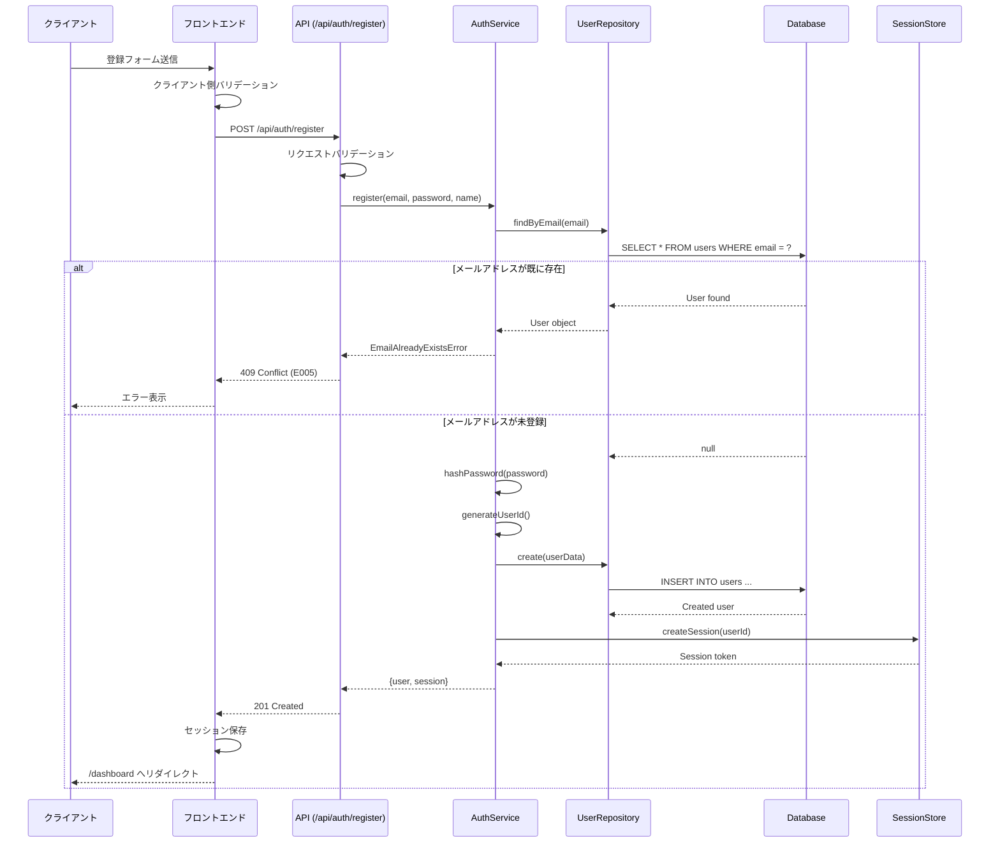

# ユーザー登録機能 詳細仕様書

## 機能ID: feature_001
## 機能名: ユーザー登録
## 概要: 新規ユーザーの登録機能（メール、パスワード、名前）

## 1. 機能概要

### 1.1 目的
- 新規ユーザーがシステムにアカウントを作成できるようにする
- セキュアな認証基盤を提供し、後続のタスク管理機能へのアクセスを可能にする

### 1.2 スコープ
- メールアドレス、パスワード、名前によるユーザー登録
- パスワードの安全なハッシュ化と保存
- メールアドレスの重複チェック
- 登録完了後の自動ログイン機能
- 基本的なバリデーション処理

### 1.3 対象外スコープ
- ソーシャルログイン（Google、GitHub等）
- 二要素認証
- メールアドレス確認機能（別機能として実装予定）

## 2. 画面仕様

### 2.1 登録画面 (/register)

#### 2.1.1 レイアウト
```
┌─────────────────────────────────────────┐
│              タスク管理アプリ             │
│                                         │
│           ユーザー登録                   │
│                                         │
│  ┌─────────────────────────────┐      │
│  │ メールアドレス *              │      │
│  │ [user@example.com        ]   │      │
│  └─────────────────────────────┘      │
│                                         │
│  ┌─────────────────────────────┐      │
│  │ パスワード *                  │      │
│  │ [••••••••                ]   │      │
│  └─────────────────────────────┘      │
│                                         │
│  ┌─────────────────────────────┐      │
│  │ 名前 *                        │      │
│  │ [山田太郎                ]   │      │
│  └─────────────────────────────┘      │
│                                         │
│  [ ] 利用規約に同意します              │
│                                         │
│  ┌─────────────────────────────┐      │
│  │        登録する               │      │
│  └─────────────────────────────┘      │
│                                         │
│  既にアカウントをお持ちの方は           │
│  [ログイン]                            │
│                                         │
└─────────────────────────────────────────┘
```

#### 2.1.2 入力項目詳細

| 項目 | 必須 | 型 | 制約 | エラーメッセージ |
|------|------|-----|------|-----------------|
| メールアドレス | ○ | email | RFC 5322準拠、255文字以内 | "有効なメールアドレスを入力してください" |
| パスワード | ○ | password | 8文字以上、半角英数字記号 | "パスワードは8文字以上で入力してください" |
| 名前 | ○ | text | 1-50文字、特殊文字可 | "名前を入力してください（50文字以内）" |
| 利用規約同意 | ○ | checkbox | - | "利用規約に同意してください" |

#### 2.1.3 画面遷移
- 成功時: /dashboard へリダイレクト（自動ログイン状態）
- 「ログイン」リンク: /login へ遷移
- ブラウザバック: 制限なし

## 3. API仕様

### 3.1 エンドポイント: POST /api/auth/register

#### 3.1.1 リクエスト
```typescript
interface RegisterRequest {
  email: string;      // RFC 5322準拠、必須
  password: string;   // 8文字以上、必須
  name: string;       // 1-50文字、必須
}
```

#### 3.1.2 レスポンス

**成功時 (201 Created)**
```typescript
interface RegisterResponse {
  user: {
    id: string;           // cuid形式
    email: string;
    name: string;
    role: "user";
    emailVerified: false;
    createdAt: string;    // ISO 8601形式
    updatedAt: string;    // ISO 8601形式
  };
  session: {
    sessionToken: string;
    expires: string;      // ISO 8601形式
  };
}
```

**エラー時**
```typescript
interface ErrorResponse {
  error: {
    code: string;         // E001, E005等
    message: string;      // ユーザー向けメッセージ
    field?: string;       // エラーが発生したフィールド名
    timestamp: string;    // ISO 8601形式
    requestId: string;    // トレース用ID
  };
}
```

#### 3.1.3 エラーコード

| コード | HTTPステータス | 説明 | 対処法 |
|--------|---------------|------|--------|
| E001 | 400 | バリデーションエラー | 入力値を確認してください |
| E005 | 409 | メールアドレス重複 | 別のメールアドレスを使用してください |
| E006 | 500 | サーバーエラー | 時間を置いて再試行してください |

### 3.2 レート制限
- 5リクエスト/分/IPアドレス
- 超過時: 429 Too Many Requests

## 4. 処理フロー

### 4.1 メインフロー


### 4.2 バリデーション処理

#### 4.2.1 クライアントサイド (Zod使用)
```typescript
const registerSchema = z.object({
  email: z.string()
    .email("有効なメールアドレスを入力してください")
    .max(255, "メールアドレスは255文字以内で入力してください"),
  password: z.string()
    .min(8, "パスワードは8文字以上で入力してください")
    .regex(/^[\x20-\x7E]+$/, "パスワードは半角英数字記号で入力してください"),
  name: z.string()
    .min(1, "名前を入力してください")
    .max(50, "名前は50文字以内で入力してください"),
  agreedToTerms: z.boolean()
    .refine(val => val === true, "利用規約に同意してください")
});
```

#### 4.2.2 サーバーサイド
- クライアントサイドと同じスキーマを使用
- 追加でSQLインジェクション対策（Prismaが自動処理）
- XSS対策（React/Next.jsが自動処理）

## 5. データベース処理

### 5.1 ユーザーテーブル操作
```sql
-- メールアドレス重複チェック
SELECT id FROM users WHERE email = ? AND deleted_at IS NULL;

-- ユーザー作成
INSERT INTO users (
  id, 
  email, 
  password_hash, 
  name, 
  role, 
  email_verified,
  created_at, 
  updated_at
) VALUES (
  'cuid_generated_id',
  'user@example.com',
  '$2b$10$hashed_password_here',
  '山田太郎',
  'user',
  false,
  NOW(),
  NOW()
);
```

### 5.2 セッション作成
```sql
INSERT INTO sessions (
  id,
  session_token,
  user_id,
  expires
) VALUES (
  'session_id',
  'secure_random_token',
  'user_id',
  NOW() + INTERVAL '24 hours'
);
```

## 6. セキュリティ考慮事項

### 6.1 パスワード処理
- bcryptによるハッシュ化（saltRounds: 10）
- プレーンテキストパスワードはメモリ上でも最小限の保持
- ハッシュ化後、即座に元のパスワード変数をクリア

### 6.2 セッション管理
- セッショントークン: 32バイトのランダム文字列
- HTTPOnly Cookie設定
- Secure属性（本番環境）
- SameSite: Lax設定
- 有効期限: 24時間

### 6.3 入力値サニタイズ
- Prismaによる自動エスケープ
- React/Next.jsによるXSS防御
- Content-Security-Policy設定

## 7. エラー処理

### 7.1 エラーケース一覧

| ケース | エラーコード | 対応 |
|--------|-------------|------|
| メールアドレス形式不正 | E001 | フィールドレベルでエラー表示 |
| パスワード条件未満 | E001 | フィールドレベルでエラー表示 |
| 名前未入力 | E001 | フィールドレベルでエラー表示 |
| メールアドレス重複 | E005 | トースト通知で表示 |
| DB接続エラー | E006 | エラー画面表示、リトライボタン提供 |
| ネットワークエラー | - | オフライン通知、自動リトライ |

### 7.2 ユーザーへの通知方法
- バリデーションエラー: 各入力フィールド下部に赤文字で表示
- システムエラー: トースト通知（画面右上）
- 致命的エラー: エラー境界によるフォールバックUI

## 8. パフォーマンス要件

### 8.1 レスポンスタイム
- 通常時: 200ms以内（p95）
- ピーク時: 500ms以内（p95）

### 8.2 スループット
- 100リクエスト/秒まで対応

### 8.3 最適化施策
- パスワードハッシュ化の非同期処理
- データベース接続プーリング
- インデックス最適化（email列）

## 9. 実装上の注意点

### 9.1 コンポーネント構成
```typescript
// app/(auth)/register/page.tsx
export default function RegisterPage() {
  // Server Component
  // メタデータ設定、初期レンダリング
}

// components/auth/RegisterForm.tsx
"use client";
export function RegisterForm() {
  // Client Component
  // フォーム処理、バリデーション、API通信
}
```

### 9.2 状態管理
- React Hook Form使用
- エラー状態はローカルステート
- 成功後のリダイレクトはrouter.push()

### 9.3 テスト観点
- 正常系: 有効な入力での登録成功
- 異常系: 各種バリデーションエラー
- 境界値: 文字数制限の境界
- セキュリティ: SQLインジェクション、XSS
- パフォーマンス: 同時登録処理

## 10. 依存関係

### 10.1 外部ライブラリ
- next-auth: 認証基盤
- bcrypt: パスワードハッシュ化
- @prisma/client: データベースアクセス
- react-hook-form: フォーム管理
- zod: バリデーション

### 10.2 内部モジュール
- AuthService: 認証ロジック
- UserRepository: ユーザーデータアクセス
- ValidationSchemas: 共通バリデーションルール

## 11. 今後の拡張予定

### 11.1 Phase 2
- メールアドレス確認機能
- パスワード強度インジケーター
- 利用規約・プライバシーポリシー画面

### 11.2 Phase 3
- ソーシャルログイン連携
- 二要素認証
- アカウント連携機能