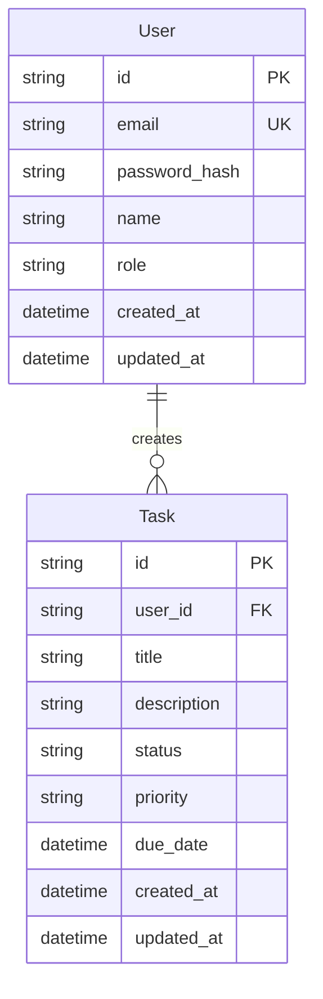
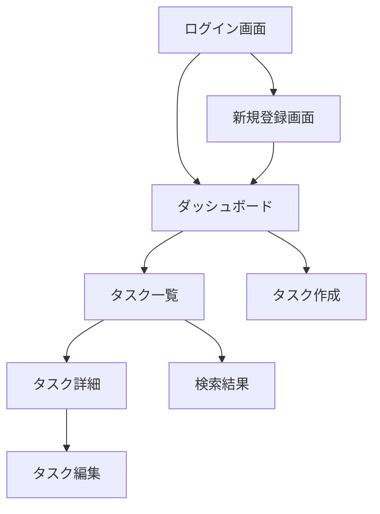

# 要件定義書

## 機能要件詳細

### 1. ユーザー管理機能

#### 1.1 ユーザー登録
- **入力項目**:
  - メールアドレス（必須、Email形式）
  - パスワード（必須、8文字以上）
  - 名前（必須、50文字以内）
- **処理**:
  1. 入力値のバリデーション
  2. メールアドレスの重複チェック
  3. パスワードのハッシュ化（bcrypt）
  4. DBへの保存
- **出力**: 登録完了後、自動ログイン

#### 1.2 ログイン
- **入力項目**:
  - メールアドレス（必須）
  - パスワード（必須）
- **処理**:
  1. 認証情報の検証
  2. セッション生成（NextAuth.js）
- **出力**: ダッシュボードへリダイレクト

#### 1.3 ログアウト
- **処理**: セッション破棄
- **出力**: ログイン画面へリダイレクト

### 2. タスクCRUD操作

#### 2.1 タスク作成
- **入力項目**:
  - タイトル（必須、100文字以内）
  - 説明（任意、500文字以内）
  - ステータス（デフォルト: 未着手）
  - 期限（任意）
- **処理**:
  1. 入力値のバリデーション
  2. ユーザーIDの紐付け
  3. DBへの保存
- **出力**: 作成完了メッセージ、タスク一覧へ遷移

#### 2.2 タスク一覧表示
- **処理**:
  1. ログインユーザーのタスクを取得
  2. ステータスごとにグループ化
- **出力**: タスクリスト（ページネーション付き）

#### 2.3 タスク編集
- **入力項目**: タスク作成と同じ
- **処理**:
  1. 権限確認（自分のタスクのみ編集可）
  2. 更新処理
- **出力**: 更新完了メッセージ

#### 2.4 タスク削除
- **処理**:
  1. 権限確認
  2. 論理削除または物理削除
- **出力**: 削除完了メッセージ

### 3. 基本検索機能
- **入力項目**: 検索キーワード（最大50文字）
- **処理**:
  1. タイトル・説明文の部分一致検索
  2. ログインユーザーのタスクのみ対象
- **出力**: 検索結果一覧

## データモデル

### ER図


### テーブル定義
```sql
-- Users table
CREATE TABLE users (
    id VARCHAR(30) PRIMARY KEY,
    email VARCHAR(255) UNIQUE NOT NULL,
    password_hash VARCHAR(255) NOT NULL,
    name VARCHAR(50) NOT NULL,
    role VARCHAR(20) DEFAULT 'user',
    created_at TIMESTAMP DEFAULT CURRENT_TIMESTAMP,
    updated_at TIMESTAMP DEFAULT CURRENT_TIMESTAMP
);

-- Tasks table
CREATE TABLE tasks (
    id VARCHAR(30) PRIMARY KEY,
    user_id VARCHAR(30) NOT NULL,
    title VARCHAR(100) NOT NULL,
    description TEXT,
    status VARCHAR(20) DEFAULT 'pending',
    priority VARCHAR(20) DEFAULT 'medium',
    due_date TIMESTAMP,
    created_at TIMESTAMP DEFAULT CURRENT_TIMESTAMP,
    updated_at TIMESTAMP DEFAULT CURRENT_TIMESTAMP,
    FOREIGN KEY (user_id) REFERENCES users(id),
    INDEX idx_user_id (user_id),
    INDEX idx_status (status),
    INDEX idx_due_date (due_date)
);
```

## API仕様

### 認証API
| メソッド | パス | 説明 | 認証 |
|---------|------|------|------|
| POST | /api/auth/register | ユーザー登録 | 不要 |
| POST | /api/auth/login | ログイン（NextAuth） | 不要 |
| POST | /api/auth/logout | ログアウト | 必要 |
| GET | /api/auth/session | セッション確認 | 必要 |

### タスクAPI
| メソッド | パス | 説明 | 認証 |
|---------|------|------|------|
| GET | /api/tasks | タスク一覧取得 | 必要 |
| POST | /api/tasks | タスク作成 | 必要 |
| GET | /api/tasks/[id] | タスク詳細取得 | 必要 |
| PUT | /api/tasks/[id] | タスク更新 | 必要 |
| DELETE | /api/tasks/[id] | タスク削除 | 必要 |
| GET | /api/tasks/search?q={keyword} | タスク検索 | 必要 |

### リクエスト/レスポンス例

#### タスク作成
```json
// Request
POST /api/tasks
{
  "title": "MVP機能の実装",
  "description": "ユーザー管理機能を実装する",
  "status": "pending",
  "dueDate": "2024-03-01T00:00:00Z"
}

// Response
{
  "id": "clm1234567890",
  "title": "MVP機能の実装",
  "description": "ユーザー管理機能を実装する",
  "status": "pending",
  "priority": "medium",
  "dueDate": "2024-03-01T00:00:00Z",
  "userId": "clm0987654321",
  "createdAt": "2024-02-15T10:00:00Z",
  "updatedAt": "2024-02-15T10:00:00Z"
}
```

## 画面遷移


### 画面一覧
1. **ログイン画面** (/login)
   - メールアドレス・パスワード入力フォーム
   - 新規登録リンク

2. **新規登録画面** (/register)
   - ユーザー情報入力フォーム
   - 利用規約同意チェックボックス

3. **ダッシュボード** (/dashboard)
   - タスクサマリー（ステータス別件数）
   - 期限が近いタスク一覧

4. **タスク一覧** (/tasks)
   - ステータス別タブ表示
   - ページネーション（20件/ページ）

5. **タスク作成/編集** (/tasks/new, /tasks/[id]/edit)
   - タスク情報入力フォーム
   - 保存・キャンセルボタン

## エラー処理

### エラーコード一覧
| エラーコード | HTTPステータス | 説明 | 対処法 |
|------------|--------------|------|--------|
| E001 | 400 | バリデーションエラー | 入力値を確認 |
| E002 | 401 | 認証エラー | ログインが必要 |
| E003 | 403 | 権限エラー | アクセス権限なし |
| E004 | 404 | リソース未検出 | URLを確認 |
| E005 | 409 | メールアドレス重複 | 別のメールアドレスを使用 |
| E006 | 500 | サーバーエラー | 時間を置いて再試行 |

### バリデーション規則
- **メールアドレス**: RFC 5322準拠
- **パスワード**: 8文字以上、英数字混在推奨
- **タスクタイトル**: 1-100文字、特殊文字可
- **タスク説明**: 0-500文字
- **日付**: ISO 8601形式

## 非機能要件

### パフォーマンス要件
- ページ読み込み: 95%が3秒以内
- API応答時間: 平均200ms以内
- 同時接続数: 100ユーザー

### セキュリティ要件
- HTTPS通信必須
- セッションタイムアウト: 24時間
- パスワード: bcryptハッシュ化
- CSRF対策: NextAuth.js標準機能
- XSS対策: React標準エスケープ

### 可用性要件
- 稼働率: 99%（月間）
- データバックアップ: 日次（Supabase標準）

## 開発環境要件
- Node.js: v20.11.x LTS
- Next.js: v14.2.x
- PostgreSQL: v15.x
- 開発用ポート: 3000（フロントエンド）

## 次のステップ
1. この要件に基づいてプロトタイプを実装
2. Supabaseプロジェクトのセットアップ
3. NextAuth.js認証フローの実装
4. 基本的なCRUD機能の動作確認