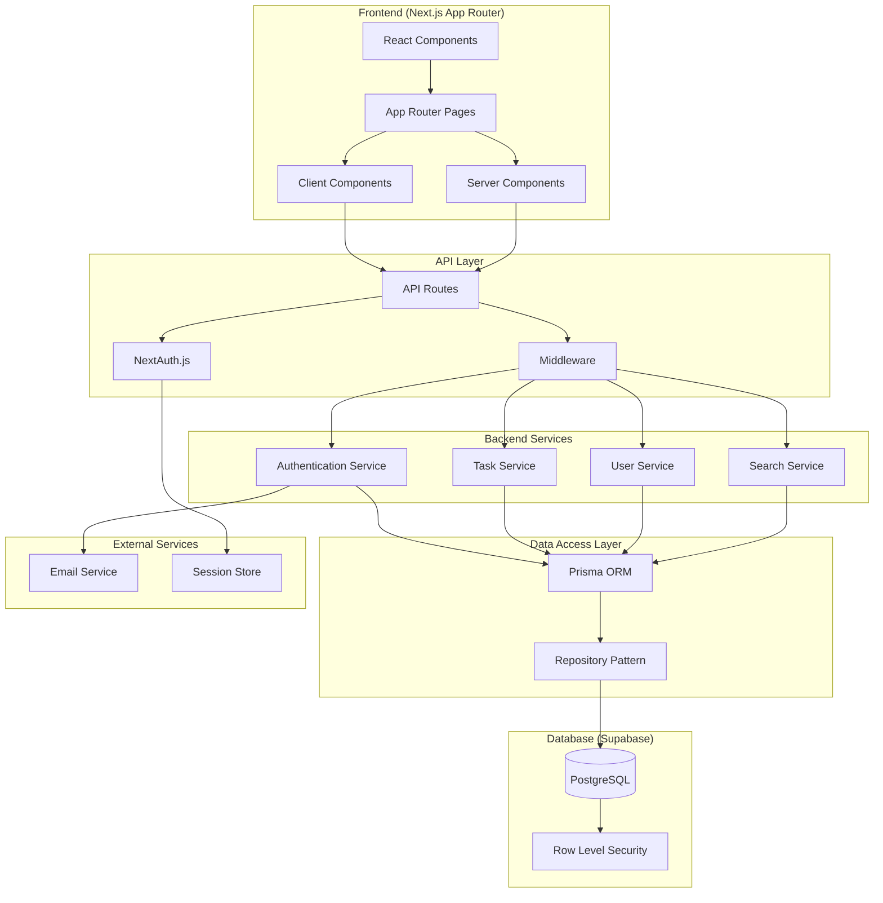
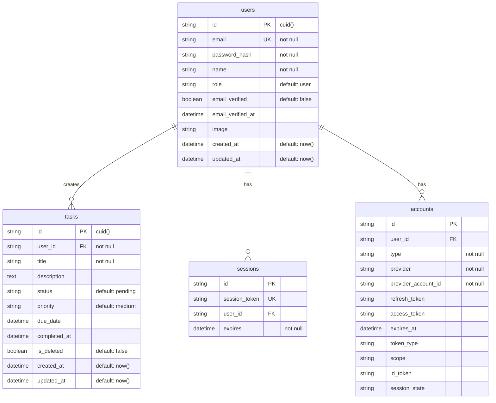
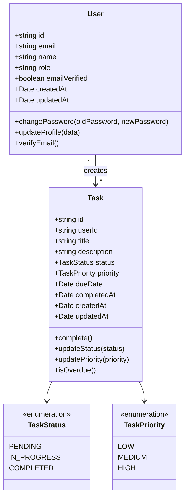
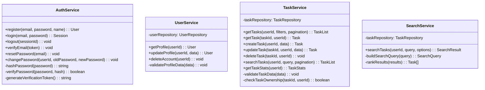
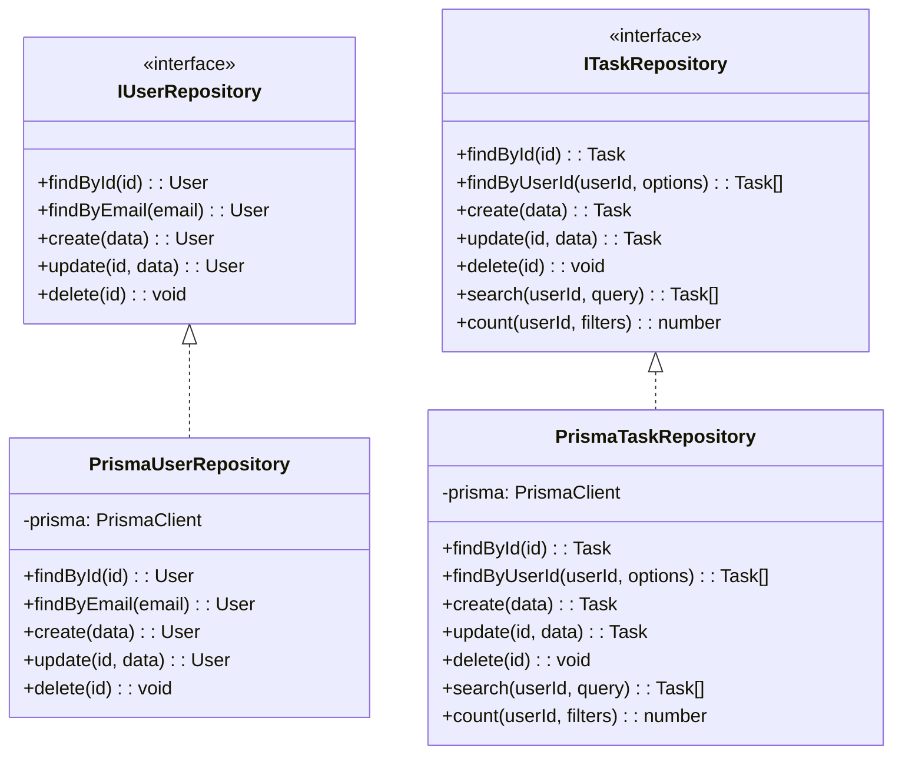
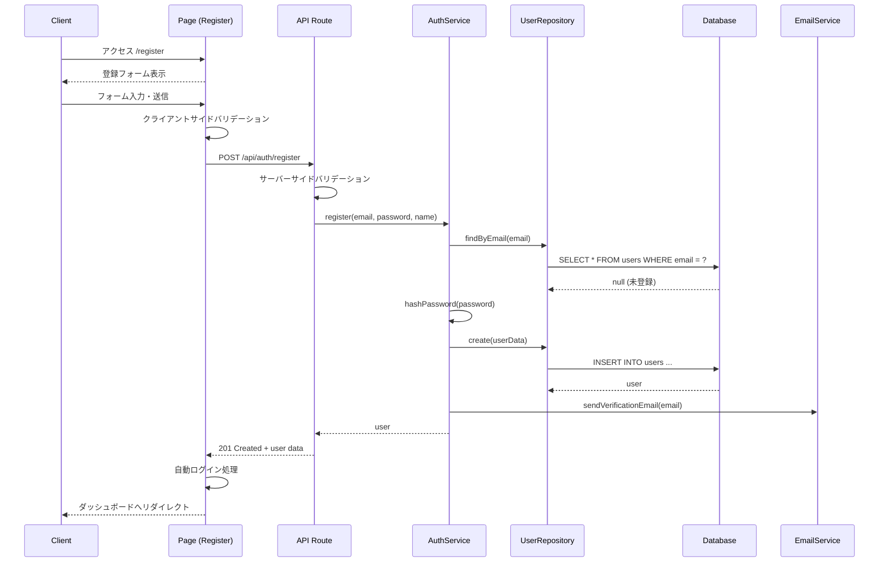
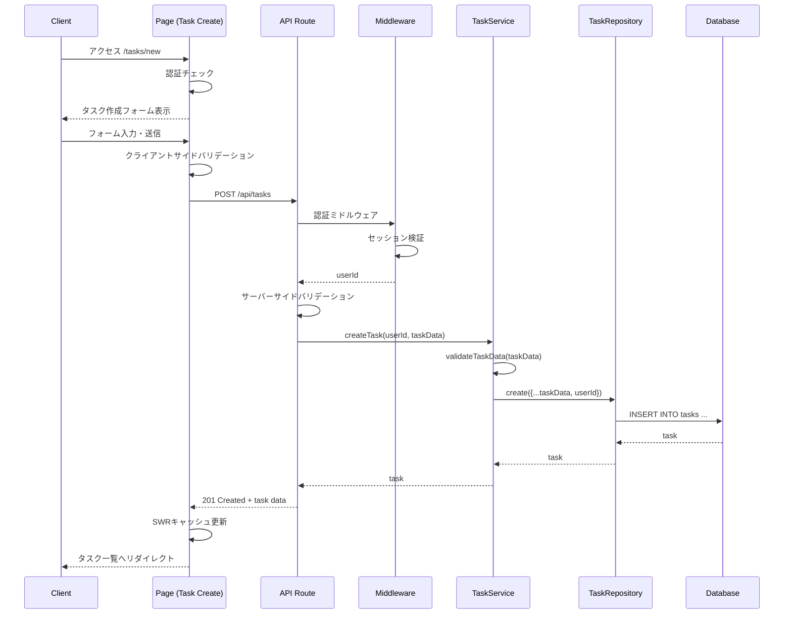
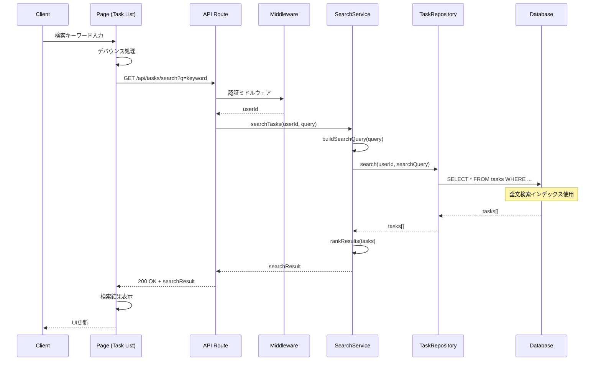
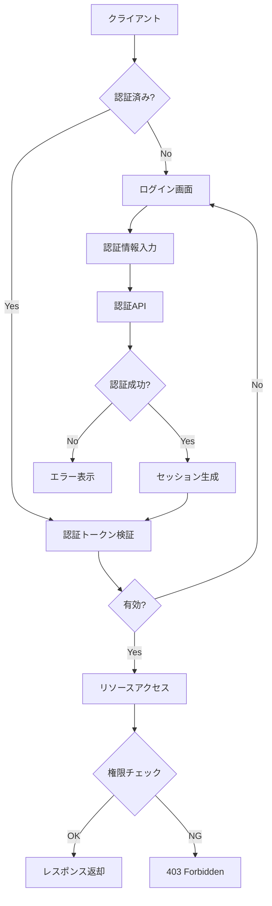
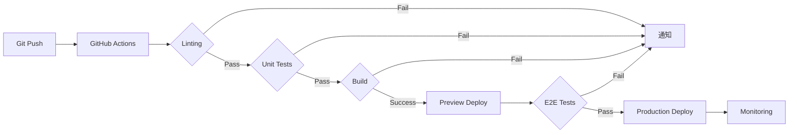

# 詳細設計書

## アーキテクチャ設計

### システム構成図


### 技術スタック詳細
- **Frontend**: 
  - Next.js 14.2.x (App Router)
  - React 18.x
  - TypeScript 5.x
  - Tailwind CSS 3.x
  - React Hook Form (フォーム管理)
  - Zod (バリデーション)
  - SWR (データフェッチング)
  - React Query (サーバー状態管理)

- **Backend**: 
  - Next.js API Routes
  - NextAuth.js v5 (認証)
  - Prisma ORM (データベース接続)
  - bcrypt (パスワードハッシュ化)
  - joi/zod (サーバーサイドバリデーション)

- **インフラ**: 
  - Vercel (ホスティング)
  - Supabase (PostgreSQL + Auth)
  - Vercel KV (セッションストア)
  - Cloudflare (CDN)

### レイヤーアーキテクチャ
```
┌─────────────────────────────────────────┐
│         Presentation Layer              │
│  (React Components, Pages, UI/UX)       │
├─────────────────────────────────────────┤
│         Application Layer               │
│  (API Routes, Business Logic)           │
├─────────────────────────────────────────┤
│         Domain Layer                    │
│  (Services, Use Cases)                  │
├─────────────────────────────────────────┤
│         Infrastructure Layer            │
│  (Repositories, External Services)      │
└─────────────────────────────────────────┘
```

## API設計

### エンドポイント一覧
| メソッド | パス | 説明 | 認証 | レート制限 |
|---------|------|------|------|------------|
| POST | /api/auth/register | ユーザー登録 | 不要 | 5/分 |
| POST | /api/auth/callback/* | NextAuth認証コールバック | 不要 | - |
| GET | /api/auth/session | セッション情報取得 | 必要 | 60/分 |
| GET | /api/users/profile | プロフィール取得 | 必要 | 30/分 |
| PUT | /api/users/profile | プロフィール更新 | 必要 | 10/分 |
| GET | /api/tasks | タスク一覧取得 | 必要 | 30/分 |
| POST | /api/tasks | タスク作成 | 必要 | 20/分 |
| GET | /api/tasks/[id] | タスク詳細取得 | 必要 | 30/分 |
| PUT | /api/tasks/[id] | タスク更新 | 必要 | 20/分 |
| DELETE | /api/tasks/[id] | タスク削除 | 必要 | 20/分 |
| GET | /api/tasks/search | タスク検索 | 必要 | 20/分 |
| GET | /api/tasks/stats | タスク統計情報 | 必要 | 10/分 |

### API詳細

#### POST /api/auth/register
- **説明**: 新規ユーザー登録
- **リクエスト**: 
  ```json
  {
    "email": "user@example.com",
    "password": "SecurePass123",
    "name": "山田太郎"
  }
  ```
- **レスポンス**:
  ```json
  {
    "id": "clm1234567890",
    "email": "user@example.com",
    "name": "山田太郎",
    "role": "user",
    "createdAt": "2024-02-15T10:00:00Z"
  }
  ```
- **エラーレスポンス**:
  ```json
  {
    "error": {
      "code": "E005",
      "message": "このメールアドレスは既に登録されています",
      "field": "email"
    }
  }
  ```

#### GET /api/tasks
- **説明**: ログインユーザーのタスク一覧を取得
- **クエリパラメータ**:
  - `page`: ページ番号（デフォルト: 1）
  - `limit`: 取得件数（デフォルト: 20、最大: 100）
  - `status`: フィルタリング（pending, in_progress, completed）
  - `sort`: ソート項目（created_at, due_date, priority）
  - `order`: ソート順（asc, desc）
- **リクエスト**: 
  ```
  GET /api/tasks?page=1&limit=20&status=pending&sort=due_date&order=asc
  ```
- **レスポンス**:
  ```json
  {
    "tasks": [
      {
        "id": "clm1234567890",
        "title": "MVP機能の実装",
        "description": "ユーザー管理機能を実装する",
        "status": "pending",
        "priority": "high",
        "dueDate": "2024-03-01T00:00:00Z",
        "createdAt": "2024-02-15T10:00:00Z",
        "updatedAt": "2024-02-15T10:00:00Z"
      }
    ],
    "pagination": {
      "page": 1,
      "limit": 20,
      "total": 45,
      "totalPages": 3
    }
  }
  ```

#### POST /api/tasks
- **説明**: 新規タスク作成
- **リクエスト**: 
  ```json
  {
    "title": "API設計書の作成",
    "description": "詳細なAPI仕様を含む設計書を作成する",
    "status": "pending",
    "priority": "high",
    "dueDate": "2024-03-05T00:00:00Z"
  }
  ```
- **レスポンス**:
  ```json
  {
    "id": "clm2345678901",
    "title": "API設計書の作成",
    "description": "詳細なAPI仕様を含む設計書を作成する",
    "status": "pending",
    "priority": "high",
    "dueDate": "2024-03-05T00:00:00Z",
    "userId": "clm0987654321",
    "createdAt": "2024-02-16T14:30:00Z",
    "updatedAt": "2024-02-16T14:30:00Z"
  }
  ```

#### GET /api/tasks/search
- **説明**: タスク検索
- **クエリパラメータ**:
  - `q`: 検索キーワード（必須、最大50文字）
  - `page`: ページ番号
  - `limit`: 取得件数
- **リクエスト**: 
  ```
  GET /api/tasks/search?q=実装&page=1&limit=10
  ```
- **レスポンス**:
  ```json
  {
    "tasks": [...],
    "pagination": {...},
    "query": "実装",
    "totalMatches": 8
  }
  ```

## データベース設計

### ER図（詳細版）


### インデックス設計
```sql
-- Users table indexes
CREATE INDEX idx_users_email ON users(email);
CREATE INDEX idx_users_created_at ON users(created_at);

-- Tasks table indexes
CREATE INDEX idx_tasks_user_id ON tasks(user_id);
CREATE INDEX idx_tasks_status ON tasks(status);
CREATE INDEX idx_tasks_due_date ON tasks(due_date);
CREATE INDEX idx_tasks_priority ON tasks(priority);
CREATE INDEX idx_tasks_created_at ON tasks(created_at);
CREATE INDEX idx_tasks_title_gin ON tasks USING gin(to_tsvector('japanese', title));
CREATE INDEX idx_tasks_description_gin ON tasks USING gin(to_tsvector('japanese', description));

-- Sessions table indexes
CREATE INDEX idx_sessions_session_token ON sessions(session_token);
CREATE INDEX idx_sessions_user_id ON sessions(user_id);
```

### Supabase Row Level Security (RLS) ポリシー
```sql
-- Users table policies
CREATE POLICY "Users can view own profile" ON users
    FOR SELECT USING (auth.uid() = id);

CREATE POLICY "Users can update own profile" ON users
    FOR UPDATE USING (auth.uid() = id);

-- Tasks table policies
CREATE POLICY "Users can view own tasks" ON tasks
    FOR SELECT USING (auth.uid() = user_id AND NOT is_deleted);

CREATE POLICY "Users can create own tasks" ON tasks
    FOR INSERT WITH CHECK (auth.uid() = user_id);

CREATE POLICY "Users can update own tasks" ON tasks
    FOR UPDATE USING (auth.uid() = user_id);

CREATE POLICY "Users can delete own tasks" ON tasks
    FOR DELETE USING (auth.uid() = user_id);
```

## クラス設計

### ドメインモデル


### サービスクラス設計


### リポジトリパターン


## シーケンス図

### ユーザー登録フロー


### タスク作成フロー


### タスク検索フロー


## コンポーネント設計

### コンポーネント階層
```
app/
├── (auth)/
│   ├── login/
│   │   └── page.tsx
│   ├── register/
│   │   └── page.tsx
│   └── layout.tsx
├── (dashboard)/
│   ├── dashboard/
│   │   └── page.tsx
│   ├── tasks/
│   │   ├── page.tsx
│   │   ├── new/
│   │   │   └── page.tsx
│   │   └── [id]/
│   │       ├── page.tsx
│   │       └── edit/
│   │           └── page.tsx
│   └── layout.tsx
├── api/
│   ├── auth/
│   │   └── [...nextauth]/
│   │       └── route.ts
│   └── tasks/
│       ├── route.ts
│       ├── [id]/
│       │   └── route.ts
│       └── search/
│           └── route.ts
└── components/
    ├── ui/
    │   ├── Button.tsx
    │   ├── Input.tsx
    │   ├── Card.tsx
    │   └── Modal.tsx
    ├── auth/
    │   ├── LoginForm.tsx
    │   └── RegisterForm.tsx
    └── tasks/
        ├── TaskList.tsx
        ├── TaskCard.tsx
        ├── TaskForm.tsx
        └── TaskSearch.tsx
```

### 主要コンポーネント仕様

#### TaskList Component
```typescript
interface TaskListProps {
  initialTasks?: Task[]
  filters?: TaskFilters
}

interface TaskFilters {
  status?: TaskStatus
  priority?: TaskPriority
  search?: string
}

// 主な機能:
// - SWRによるデータフェッチング
// - 無限スクロール
// - リアルタイム更新
// - フィルタリング
// - ソート機能
```

#### TaskForm Component
```typescript
interface TaskFormProps {
  task?: Task // 編集時のみ
  onSubmit: (data: TaskFormData) => Promise<void>
  onCancel: () => void
}

interface TaskFormData {
  title: string
  description?: string
  status: TaskStatus
  priority: TaskPriority
  dueDate?: Date
}

// 主な機能:
// - React Hook Formによるフォーム管理
// - Zodによるバリデーション
// - エラーハンドリング
// - 最適化されたレンダリング
```

## セキュリティ設計

### 認証・認可フロー


### セキュリティ対策一覧
| 脅威 | 対策 | 実装詳細 |
|------|------|----------|
| SQLインジェクション | Prisma ORM使用 | パラメータバインディング |
| XSS | React自動エスケープ | dangerouslySetInnerHTML不使用 |
| CSRF | NextAuth.js CSRF保護 | csrfTokenの検証 |
| セッションハイジャック | Secure Cookie | httpOnly, secure, sameSite設定 |
| パスワード漏洩 | bcryptハッシュ化 | saltRounds: 10 |
| 総当たり攻撃 | レート制限 | 5回/分の試行制限 |
| 不正なデータアクセス | RLS (Row Level Security) | Supabaseポリシー設定 |

## パフォーマンス最適化

### フロントエンド最適化
- **Code Splitting**: 動的インポートによる遅延読み込み
- **Image Optimization**: Next.js Imageコンポーネント使用
- **Bundle Size**: Tree shakingとminification
- **Caching**: SWRによるクライアントサイドキャッシュ
- **Prefetching**: Next.js Linkによる自動プリフェッチ

### バックエンド最適化
- **Database Query**: インデックス最適化
- **N+1問題対策**: Prismaのinclude/select最適化
- **Response Caching**: Vercel Edge Caching
- **Connection Pooling**: Prisma接続プール設定

### 監視・計測
- **Core Web Vitals**: LCP < 2.5s, FID < 100ms, CLS < 0.1
- **API Response Time**: p95 < 200ms
- **Error Rate**: < 0.1%
- **Uptime**: > 99.9%

## エラーハンドリング設計

### グローバルエラーハンドラー
```typescript
class AppError extends Error {
  constructor(
    public code: string,
    public message: string,
    public statusCode: number,
    public field?: string
  ) {
    super(message)
  }
}

// エラーレスポンス形式
interface ErrorResponse {
  error: {
    code: string
    message: string
    field?: string
    timestamp: string
    requestId: string
  }
}
```

### エラー処理フロー
1. **バリデーションエラー**: フィールドレベルで表示
2. **認証エラー**: ログイン画面へリダイレクト
3. **権限エラー**: エラーページ表示
4. **サーバーエラー**: フォールバックUI表示
5. **ネットワークエラー**: リトライ機能提供

## デプロイメント設計

### CI/CDパイプライン


### 環境構成
| 環境 | URL | 用途 | データベース |
|------|-----|------|------------|
| Development | http://localhost:3000 | 開発 | ローカルPostgreSQL |
| Preview | https://preview-*.vercel.app | PR確認 | Supabase (Dev) |
| Staging | https://staging.example.com | 統合テスト | Supabase (Staging) |
| Production | https://app.example.com | 本番 | Supabase (Production) |

## 今後の拡張性考慮

### スケーラビリティ
- **水平スケーリング**: Vercelの自動スケーリング
- **データベース**: Supabaseの読み取りレプリカ
- **キャッシュレイヤー**: Redis導入準備
- **CDN**: 静的アセットの配信最適化

### 機能拡張への対応
- **マイクロサービス化**: モジュラーアーキテクチャ
- **API versioning**: /api/v1/の準備
- **プラグインシステム**: 拡張ポイントの設計
- **国際化対応**: i18nフレームワーク準備

### 技術的負債の管理
- **コードメトリクス**: 複雑度の監視
- **依存関係管理**: Dependabotによる自動更新
- **リファクタリング**: 定期的な改善サイクル
- **ドキュメント**: 自動生成とメンテナンス