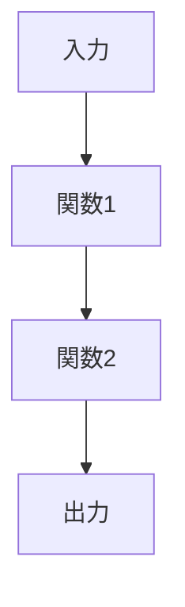

# 関数仕様書生成: ${feature_name}

## タスク
この機能をコンテキストエンジニアリングの原則に従って設計し、詳細な関数仕様書を作成してください。

## コンテキストエンジニアリング原則
1. **単一責任** - 1関数1責任（最大20行）
2. **純粋関数優先** - 副作用を最小化
3. **合成可能** - 小さな関数を組み合わせる
4. **型安全** - TypeScriptの型を最大活用
5. **テスト可能** - 依存性注入とモック可能な設計

## 要件
${requirements_content}

## 既存パターン
${patterns_content}

## 出力形式
```markdown
# ${feature_name} - 関数仕様書

## 概要
機能の目的と価値を1文で記述

## アーキテクチャ


## 関数定義

### 関数1: functionName
```typescript
type InputType = {
  field1: string;
  field2: number;
}

type OutputType = {
  result: string;
}

function functionName(input: InputType): OutputType
```

**責任**: 具体的な責任を記述
**事前条件**: 
- 条件1
- 条件2
**事後条件**:
- 結果1
- 結果2

## エラーハンドリング
- エラーケース1: 対処法
- エラーケース2: 対処法

## 使用例
```typescript
// 使用例のコード
```
```