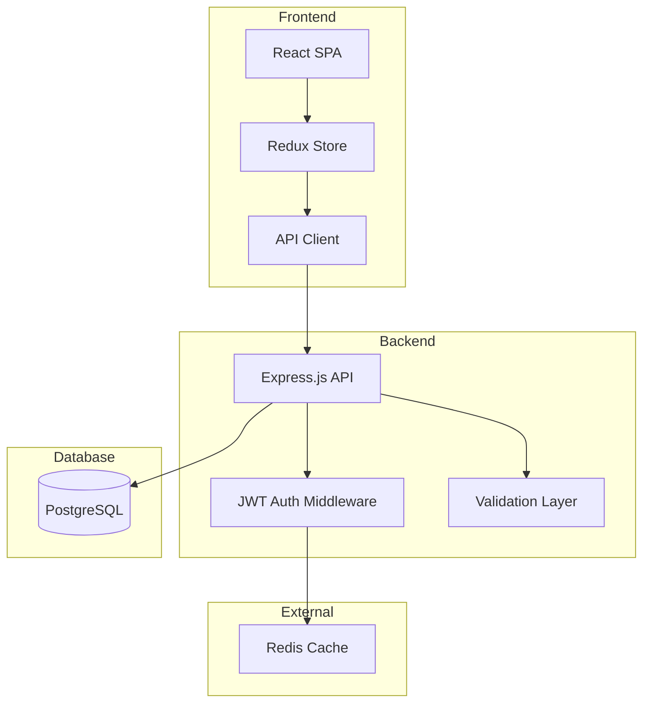
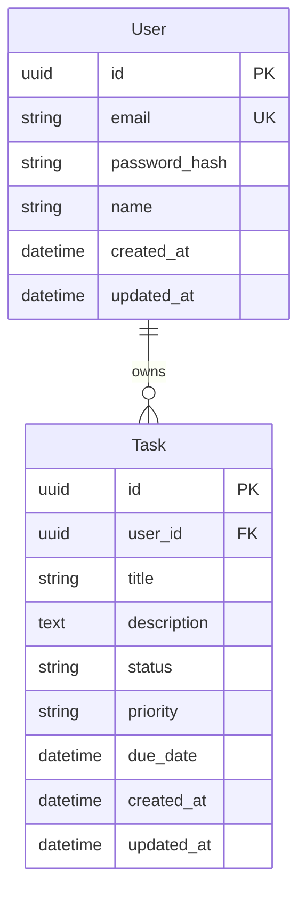
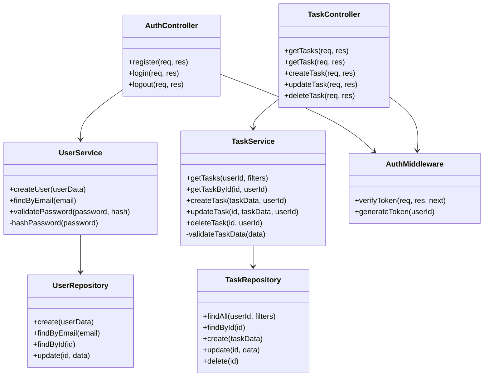
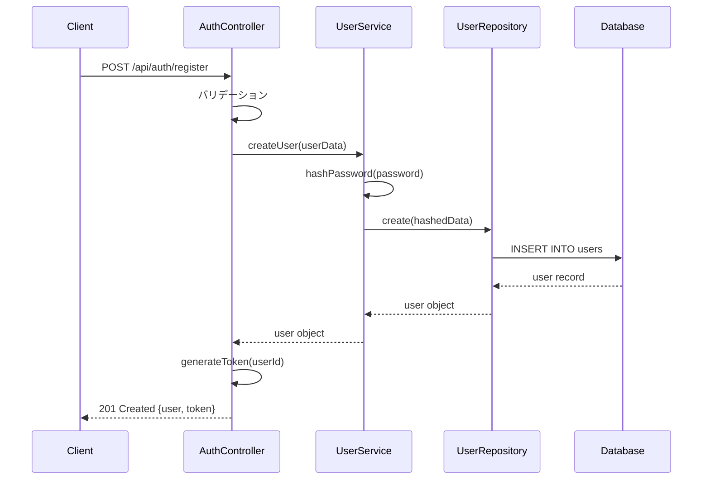
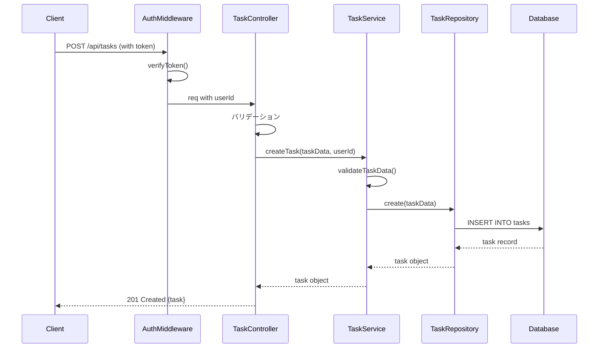

# 詳細設計書

## アーキテクチャ設計
### システム構成図


### 技術スタック詳細
- **Frontend**: 
  - React 18.2.0 (機能コンポーネント + Hooks)
  - Redux Toolkit (状態管理)
  - Axios (HTTP通信)
  - Material-UI (UIコンポーネント)
  - React Router v6 (ルーティング)
- **Backend**: 
  - Node.js 18.x
  - Express.js 4.18.2
  - TypeScript 5.0
  - Prisma ORM (データベースアクセス)
  - bcrypt (パスワードハッシュ化)
  - jsonwebtoken (JWT認証)
- **インフラ**: 
  - PostgreSQL 15 (メインデータベース)
  - Redis 7.0 (セッション管理)
  - Docker & Docker Compose (開発環境)

## API設計
### エンドポイント一覧
| メソッド | パス | 説明 | 認証 |
|---------|------|------|------|
| POST | /api/auth/register | ユーザー登録 | 不要 |
| POST | /api/auth/login | ログイン | 不要 |
| POST | /api/auth/logout | ログアウト | 要 |
| GET | /api/users/me | 現在のユーザー情報取得 | 要 |
| PUT | /api/users/me | ユーザー情報更新 | 要 |
| GET | /api/tasks | タスク一覧取得 | 要 |
| POST | /api/tasks | タスク作成 | 要 |
| GET | /api/tasks/:id | タスク詳細取得 | 要 |
| PUT | /api/tasks/:id | タスク更新 | 要 |
| DELETE | /api/tasks/:id | タスク削除 | 要 |

### API詳細
#### POST /api/auth/register
- **説明**: 新規ユーザー登録
- **リクエスト**: 
  ```json
  {
    "email": "user@example.com",
    "password": "securePassword123",
    "name": "山田太郎"
  }
  ```
- **レスポンス**:
  ```json
  {
    "user": {
      "id": "550e8400-e29b-41d4-a716-446655440000",
      "email": "user@example.com",
      "name": "山田太郎"
    },
    "token": "eyJhbGciOiJIUzI1NiIsInR5cCI6IkpXVCJ9..."
  }
  ```

#### GET /api/tasks
- **説明**: ユーザーのタスク一覧を取得
- **リクエストパラメータ**: 
  - `status`: "pending" | "in_progress" | "completed" (オプション)
  - `page`: ページ番号 (デフォルト: 1)
  - `limit`: 1ページあたりの件数 (デフォルト: 20, 最大: 100)
- **レスポンス**:
  ```json
  {
    "tasks": [
      {
        "id": "123e4567-e89b-12d3-a456-426614174000",
        "title": "設計書作成",
        "description": "詳細設計書を作成する",
        "status": "in_progress",
        "priority": "high",
        "dueDate": "2024-01-20T00:00:00Z",
        "createdAt": "2024-01-10T10:00:00Z",
        "updatedAt": "2024-01-15T14:30:00Z"
      }
    ],
    "pagination": {
      "page": 1,
      "limit": 20,
      "total": 45,
      "totalPages": 3
    }
  }
  ```

## データベース設計
### ER図


### テーブル定義
#### Users テーブル
| カラム名 | データ型 | 制約 | 説明 |
|----------|----------|------|------|
| id | UUID | PRIMARY KEY | ユーザーID |
| email | VARCHAR(255) | UNIQUE, NOT NULL | メールアドレス |
| password_hash | VARCHAR(255) | NOT NULL | パスワードハッシュ |
| name | VARCHAR(100) | NOT NULL | ユーザー名 |
| created_at | TIMESTAMP | NOT NULL | 作成日時 |
| updated_at | TIMESTAMP | NOT NULL | 更新日時 |

#### Tasks テーブル
| カラム名 | データ型 | 制約 | 説明 |
|----------|----------|------|------|
| id | UUID | PRIMARY KEY | タスクID |
| user_id | UUID | FOREIGN KEY, NOT NULL | ユーザーID |
| title | VARCHAR(200) | NOT NULL | タスクタイトル |
| description | TEXT | | タスク詳細 |
| status | VARCHAR(20) | NOT NULL | ステータス |
| priority | VARCHAR(10) | NOT NULL | 優先度 |
| due_date | TIMESTAMP | | 期限 |
| created_at | TIMESTAMP | NOT NULL | 作成日時 |
| updated_at | TIMESTAMP | NOT NULL | 更新日時 |

## クラス設計
### クラス図


## シーケンス図
### ユーザー登録フロー


### タスク作成フロー


## エラー処理設計
### エラーコード体系
| コード | 説明 | HTTPステータス |
|--------|------|----------------|
| AUTH001 | 認証失敗 | 401 |
| AUTH002 | トークン無効 | 401 |
| AUTH003 | トークン期限切れ | 401 |
| USER001 | ユーザー登録失敗 | 400 |
| USER002 | メールアドレス重複 | 409 |
| TASK001 | タスク作成失敗 | 400 |
| TASK002 | タスクが見つからない | 404 |
| TASK003 | 権限なし | 403 |
| SYSTEM001 | 内部サーバーエラー | 500 |

### エラーレスポンス形式
```json
{
  "error": {
    "code": "AUTH001",
    "message": "メールアドレスまたはパスワードが正しくありません",
    "timestamp": "2024-01-15T10:30:00Z"
  }
}
```

## セキュリティ設計
### 認証・認可
- JWT Bearer トークンによる認証
- トークン有効期限: 7日間
- リフレッシュトークン: 実装予定（Phase 2）

### データ保護
- パスワード: bcrypt (salt rounds: 10)
- HTTPS通信必須
- CORS設定: 許可されたオリジンのみ
- Rate Limiting: 1分間に60リクエスト/IP

### 入力検証
- すべての入力値をサニタイズ
- SQLインジェクション対策: Prepared Statements使用
- XSS対策: 出力時のエスケープ処理