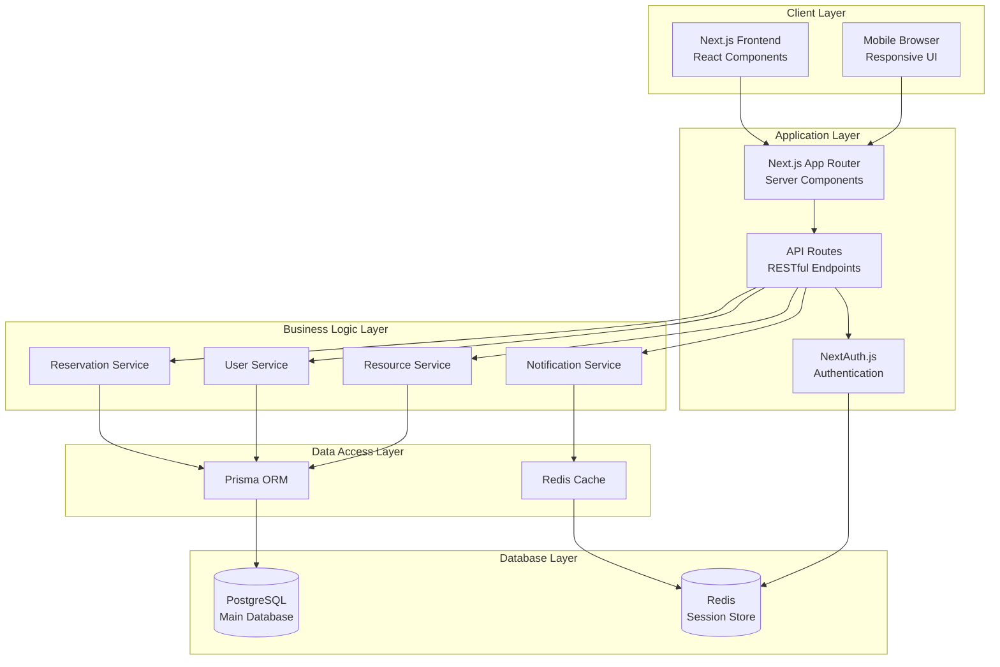
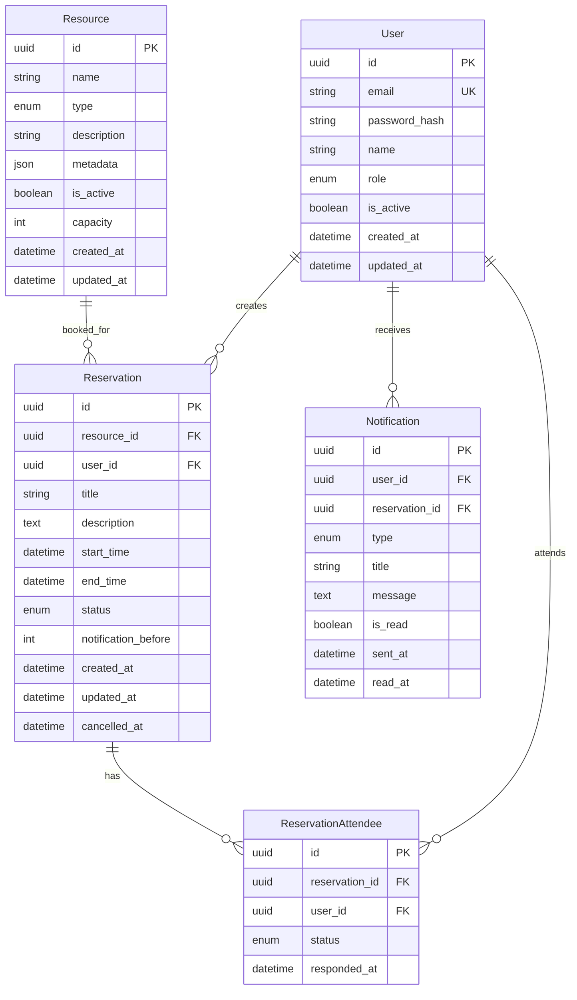
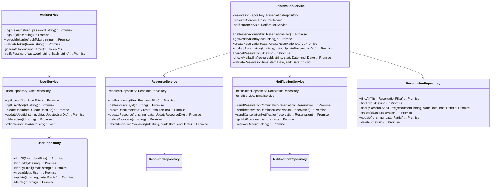
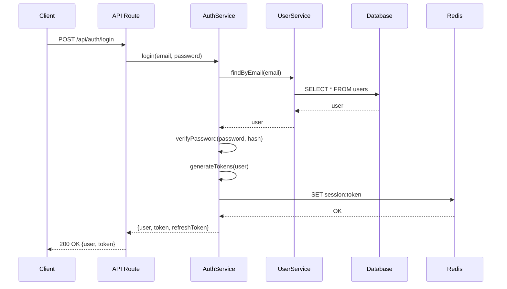
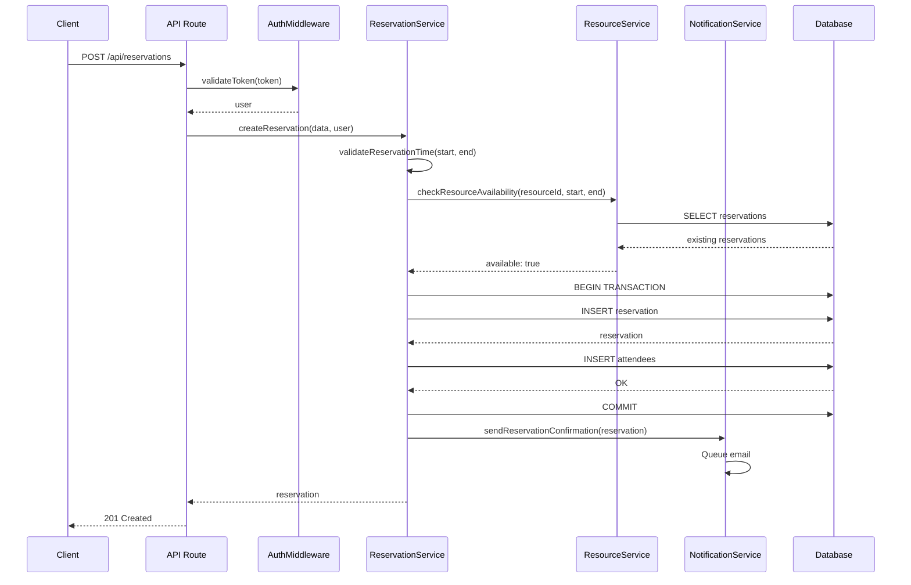
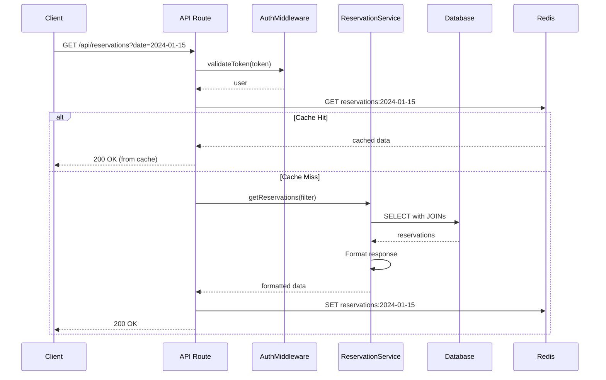
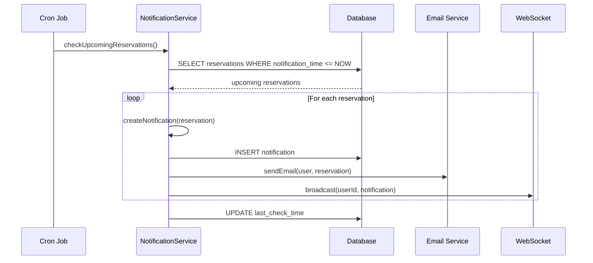

# 詳細設計書

## アーキテクチャ設計
### システム構成図


### 技術スタック詳細
- **Frontend**: 
  - Next.js 14 (App Router)
  - React 18
  - TypeScript 5
  - Tailwind CSS 3
  - React Query (データフェッチング)
  - React Hook Form (フォーム管理)
  - FullCalendar (カレンダーUI)
  
- **Backend**: 
  - Next.js API Routes
  - TypeScript 5
  - Prisma ORM
  - Zod (バリデーション)
  - bcrypt (パスワード暗号化)
  - jsonwebtoken (JWT)
  
- **インフラ**: 
  - Vercel (アプリケーションホスティング)
  - Vercel Postgres (データベース)
  - Vercel KV (Redis互換キャッシュ)
  - GitHub Actions (CI/CD)

## API設計
### エンドポイント一覧
| メソッド | パス | 説明 | 認証 |
|---------|------|------|------|
| POST | /api/auth/login | ユーザーログイン | 不要 |
| POST | /api/auth/logout | ユーザーログアウト | 要 |
| POST | /api/auth/refresh | トークンリフレッシュ | 要 |
| GET | /api/users | ユーザー一覧取得 | 要(管理者) |
| GET | /api/users/:id | ユーザー詳細取得 | 要 |
| POST | /api/users | ユーザー作成 | 要(管理者) |
| PUT | /api/users/:id | ユーザー更新 | 要 |
| DELETE | /api/users/:id | ユーザー削除 | 要(管理者) |
| GET | /api/reservations | 予約一覧取得 | 要 |
| GET | /api/reservations/:id | 予約詳細取得 | 要 |
| POST | /api/reservations | 予約作成 | 要 |
| PUT | /api/reservations/:id | 予約更新 | 要 |
| DELETE | /api/reservations/:id | 予約削除 | 要 |
| GET | /api/resources | リソース一覧取得 | 要 |
| GET | /api/resources/:id | リソース詳細取得 | 要 |
| POST | /api/resources | リソース作成 | 要(管理者) |
| PUT | /api/resources/:id | リソース更新 | 要(管理者) |
| DELETE | /api/resources/:id | リソース削除 | 要(管理者) |

### API詳細
#### POST /api/auth/login
- **説明**: ユーザー認証を行い、JWTトークンを発行
- **リクエスト**: 
  ```json
  {
    "email": "user@example.com",
    "password": "password123"
  }
  ```
- **レスポンス**:
  ```json
  {
    "user": {
      "id": "uuid",
      "email": "user@example.com",
      "name": "User Name",
      "role": "user"
    },
    "token": "jwt-token",
    "refreshToken": "refresh-token"
  }
  ```

#### GET /api/reservations
- **説明**: 予約一覧を取得（フィルタリング・ページネーション対応）
- **クエリパラメータ**:
  - `resourceId`: リソースID（オプション）
  - `userId`: ユーザーID（オプション）
  - `startDate`: 開始日（ISO 8601形式）
  - `endDate`: 終了日（ISO 8601形式）
  - `status`: ステータス（active, cancelled, completed）
  - `page`: ページ番号（デフォルト: 1）
  - `limit`: 1ページあたりの件数（デフォルト: 20）
- **レスポンス**:
  ```json
  {
    "reservations": [
      {
        "id": "uuid",
        "resourceId": "uuid",
        "userId": "uuid",
        "title": "会議室予約",
        "startTime": "2024-01-15T10:00:00Z",
        "endTime": "2024-01-15T11:00:00Z",
        "status": "active",
        "createdAt": "2024-01-10T08:00:00Z",
        "resource": {
          "id": "uuid",
          "name": "会議室A",
          "type": "meeting_room"
        },
        "user": {
          "id": "uuid",
          "name": "User Name"
        }
      }
    ],
    "pagination": {
      "total": 100,
      "page": 1,
      "limit": 20,
      "totalPages": 5
    }
  }
  ```

#### POST /api/reservations
- **説明**: 新規予約を作成
- **リクエスト**:
  ```json
  {
    "resourceId": "uuid",
    "title": "会議室予約",
    "description": "定例会議",
    "startTime": "2024-01-15T10:00:00Z",
    "endTime": "2024-01-15T11:00:00Z",
    "attendees": ["user1@example.com", "user2@example.com"],
    "notificationBefore": 15
  }
  ```
- **レスポンス**:
  ```json
  {
    "id": "uuid",
    "resourceId": "uuid",
    "userId": "uuid",
    "title": "会議室予約",
    "description": "定例会議",
    "startTime": "2024-01-15T10:00:00Z",
    "endTime": "2024-01-15T11:00:00Z",
    "status": "active",
    "attendees": ["user1@example.com", "user2@example.com"],
    "notificationBefore": 15,
    "createdAt": "2024-01-10T08:00:00Z"
  }
  ```

## データベース設計
### ER図


### テーブル定義
#### users テーブル
| カラム名 | 型 | 制約 | 説明 |
|---------|-----|------|------|
| id | UUID | PK | ユーザーID |
| email | VARCHAR(255) | UNIQUE, NOT NULL | メールアドレス |
| password_hash | VARCHAR(255) | NOT NULL | パスワードハッシュ |
| name | VARCHAR(100) | NOT NULL | ユーザー名 |
| role | ENUM('admin', 'user') | NOT NULL, DEFAULT 'user' | 権限 |
| is_active | BOOLEAN | NOT NULL, DEFAULT true | アクティブフラグ |
| created_at | TIMESTAMP | NOT NULL | 作成日時 |
| updated_at | TIMESTAMP | NOT NULL | 更新日時 |

#### resources テーブル
| カラム名 | 型 | 制約 | 説明 |
|---------|-----|------|------|
| id | UUID | PK | リソースID |
| name | VARCHAR(100) | NOT NULL | リソース名 |
| type | ENUM('meeting_room', 'equipment', 'facility') | NOT NULL | リソース種別 |
| description | TEXT | | 説明 |
| metadata | JSONB | | メタデータ |
| is_active | BOOLEAN | NOT NULL, DEFAULT true | アクティブフラグ |
| capacity | INTEGER | | 収容人数/数量 |
| created_at | TIMESTAMP | NOT NULL | 作成日時 |
| updated_at | TIMESTAMP | NOT NULL | 更新日時 |

#### reservations テーブル
| カラム名 | 型 | 制約 | 説明 |
|---------|-----|------|------|
| id | UUID | PK | 予約ID |
| resource_id | UUID | FK, NOT NULL | リソースID |
| user_id | UUID | FK, NOT NULL | ユーザーID |
| title | VARCHAR(200) | NOT NULL | 予約タイトル |
| description | TEXT | | 予約説明 |
| start_time | TIMESTAMP | NOT NULL | 開始時刻 |
| end_time | TIMESTAMP | NOT NULL | 終了時刻 |
| status | ENUM('active', 'cancelled', 'completed') | NOT NULL, DEFAULT 'active' | ステータス |
| notification_before | INTEGER | | 通知タイミング（分） |
| created_at | TIMESTAMP | NOT NULL | 作成日時 |
| updated_at | TIMESTAMP | NOT NULL | 更新日時 |
| cancelled_at | TIMESTAMP | | キャンセル日時 |

### インデックス
- users.email (UNIQUE)
- reservations.resource_id
- reservations.user_id
- reservations.start_time
- reservations.end_time
- reservations.status
- (resource_id, start_time, end_time) - 予約重複チェック用複合インデックス

## クラス設計
### クラス図


## シーケンス図
### ユーザーログインフロー


### 予約作成フロー


### 予約検索フロー


### リアルタイム通知フロー


## セキュリティ設計
### 認証・認可
- JWT (JSON Web Token) によるステートレス認証
- アクセストークン有効期限: 1時間
- リフレッシュトークン有効期限: 7日間
- Role-Based Access Control (RBAC)

### データ保護
- パスワード: bcrypt (ラウンド数: 10)
- HTTPS通信の強制
- SQLインジェクション対策: Prisma ORM使用
- XSS対策: React自動エスケープ + Content Security Policy
- CSRF対策: SameSite Cookieとトークン検証

### 監査ログ
- 全APIアクセスログ記録
- 重要操作（作成・更新・削除）の記録
- ログ保持期間: 90日間

## パフォーマンス最適化
### キャッシュ戦略
- Redis使用によるセッション管理
- 予約一覧のキャッシュ (TTL: 5分)
- リソース情報のキャッシュ (TTL: 1時間)

### データベース最適化
- 適切なインデックスの設定
- N+1問題対策: Prisma includeの活用
- コネクションプーリング設定

### フロントエンド最適化
- Next.js Server Componentsによる初期表示高速化
- React Queryによるクライアントサイドキャッシュ
- 画像最適化: next/imageの使用
- Code Splitting: dynamic importの活用