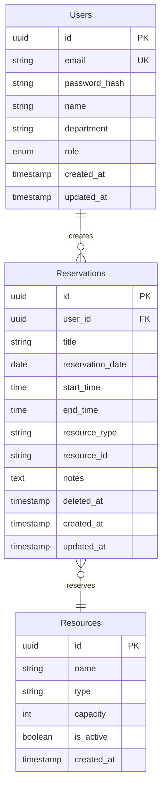
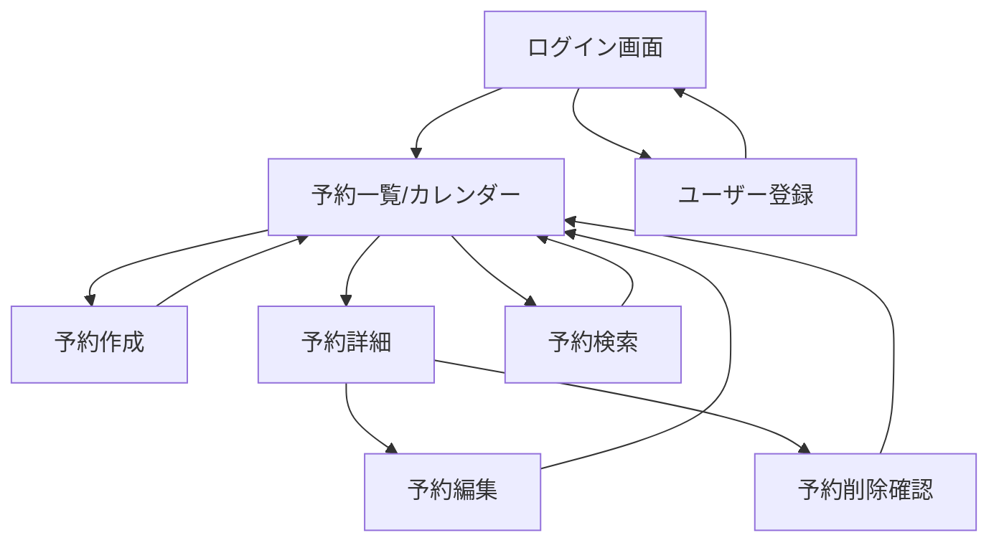

# 要件定義書

## プロジェクト概要
- **プロジェクト名**: 予約管理システム
- **対象**: 中規模組織（100人程度）向け予約管理
- **スコープ**: MVP（最小要件）に集中した仕様

## 機能要件詳細

### 1. ユーザー管理・認証機能
#### 1.1 ユーザー登録
- **入力項目**:
  - メールアドレス（必須、Email形式）
  - パスワード（必須、8文字以上、英数字混在）
  - 氏名（必須、50文字以内）
  - 部署名（任意、50文字以内）
- **処理**:
  1. 入力値のバリデーション
  2. メールアドレスの重複チェック
  3. パスワードのbcryptハッシュ化（salt rounds: 12）
  4. データベースへの保存
- **出力**: 
  - 成功時: ユーザーID、登録完了メッセージ
  - 失敗時: エラーメッセージ

#### 1.2 ログイン
- **入力項目**:
  - メールアドレス
  - パスワード
- **処理**:
  1. ユーザー検証
  2. JWT（Access Token + Refresh Token）発行
  3. ログイン履歴記録
- **出力**:
  - 成功時: JWT Token、ユーザー情報
  - 失敗時: 認証エラー

#### 1.3 権限管理
- **ユーザーロール**:
  - 管理者: 全予約の閲覧・編集・削除可能
  - 一般ユーザー: 自分の予約のみ編集・削除可能

### 2. 予約CRUD機能
#### 2.1 予約作成
- **入力項目**:
  - 予約タイトル（必須、100文字以内）
  - 予約日（必須）
  - 開始時刻（必須、30分単位）
  - 終了時刻（必須、30分単位）
  - 予約対象（必須、ドロップダウン選択）
  - 備考（任意、500文字以内）
- **処理**:
  1. 時間の妥当性チェック（開始 < 終了）
  2. 重複予約チェック（同一リソース・時間帯）
  3. トランザクション処理での保存
- **出力**: 予約ID、作成完了メッセージ

#### 2.2 予約一覧・詳細表示
- **表示項目**:
  - カレンダービュー（月表示）
  - リスト表示（日付順）
  - 予約詳細（全項目 + 予約者情報）
- **フィルタ**:
  - 自分の予約のみ/全予約
  - 予約対象別

#### 2.3 予約編集
- **条件**: 自分の予約 または 管理者権限
- **編集可能項目**: 作成時と同じ
- **処理**: 作成時と同様の検証 + 楽観的ロック

#### 2.4 予約削除
- **条件**: 自分の予約 または 管理者権限
- **処理**: 論理削除（deleted_atフラグ）

### 3. 予約検索機能
- **検索条件**:
  - 日付範囲（開始日～終了日）
  - 予約者名（部分一致）
  - 予約対象
  - キーワード（タイトル・備考から検索）
- **ソート**: 日付昇順/降順、作成日時順

### 4. レスポンシブデザイン
- **対応デバイス**: PC、タブレット、スマートフォン
- **ブレークポイント**: 
  - Mobile: ～767px
  - Tablet: 768px～1023px
  - Desktop: 1024px～

## データモデル

### ER図


### インデックス設計
- Users: email (UNIQUE)
- Reservations: 
  - (resource_id, reservation_date, deleted_at)
  - (user_id, deleted_at)
  - (reservation_date, deleted_at)

## API仕様

### 認証API
| メソッド | パス | 説明 | 認証 |
|---------|------|------|------|
| POST | /api/auth/register | ユーザー登録 | 不要 |
| POST | /api/auth/login | ログイン | 不要 |
| POST | /api/auth/refresh | トークン更新 | Refresh Token |
| POST | /api/auth/logout | ログアウト | 必要 |
| GET | /api/auth/me | 現在のユーザー情報 | 必要 |

### 予約API
| メソッド | パス | 説明 | 認証 |
|---------|------|------|------|
| GET | /api/reservations | 予約一覧取得 | 必要 |
| GET | /api/reservations/:id | 予約詳細取得 | 必要 |
| POST | /api/reservations | 予約作成 | 必要 |
| PUT | /api/reservations/:id | 予約更新 | 必要 |
| DELETE | /api/reservations/:id | 予約削除 | 必要 |
| GET | /api/reservations/search | 予約検索 | 必要 |

### リソースAPI
| メソッド | パス | 説明 | 認証 |
|---------|------|------|------|
| GET | /api/resources | リソース一覧 | 必要 |

### リクエスト/レスポンス例

#### ユーザー登録
```json
// Request
POST /api/auth/register
{
  "email": "user@example.com",
  "password": "Password123",
  "name": "山田太郎",
  "department": "営業部"
}

// Response
{
  "id": "550e8400-e29b-41d4-a716-446655440000",
  "email": "user@example.com",
  "name": "山田太郎",
  "role": "user"
}
```

#### 予約作成
```json
// Request
POST /api/reservations
{
  "title": "週次定例会議",
  "reservation_date": "2024-12-20",
  "start_time": "10:00",
  "end_time": "11:00",
  "resource_id": "550e8400-e29b-41d4-a716-446655440001",
  "notes": "アジェンダは別途送付"
}

// Response
{
  "id": "550e8400-e29b-41d4-a716-446655440002",
  "title": "週次定例会議",
  "status": "confirmed",
  "created_at": "2024-12-15T09:00:00Z"
}
```

## 画面遷移



## エラー処理とバリデーション

### エラーコード一覧
| コード | HTTPステータス | 説明 | ユーザー向けメッセージ |
|--------|---------------|------|----------------------|
| AUTH001 | 401 | 認証失敗 | メールアドレスまたはパスワードが正しくありません |
| AUTH002 | 401 | トークン期限切れ | セッションの有効期限が切れました。再度ログインしてください |
| AUTH003 | 403 | 権限不足 | この操作を行う権限がありません |
| USER001 | 409 | メール重複 | このメールアドレスは既に登録されています |
| RESV001 | 409 | 予約重複 | 指定された時間帯は既に予約されています |
| RESV002 | 400 | 無効な時間 | 開始時刻は終了時刻より前に設定してください |
| RESV003 | 404 | 予約なし | 指定された予約が見つかりません |
| VAL001 | 400 | 入力エラー | 入力内容に誤りがあります |

### バリデーション規則
- **メールアドレス**: RFC5322準拠
- **パスワード**: 8文字以上、大文字・小文字・数字を各1文字以上含む
- **日付**: ISO 8601形式（YYYY-MM-DD）
- **時刻**: HH:MM形式、30分単位
- **テキスト**: XSS対策のため、HTMLタグは自動エスケープ

## 非機能要件

### パフォーマンス要件
- **レスポンスタイム**: 
  - API: 95%tile < 200ms
  - 画面表示: 3秒以内
- **同時接続**: 100ユーザー

### セキュリティ要件
- **通信**: HTTPS必須（TLS 1.3）
- **認証**: JWT（HTTPOnly Cookie）
- **セッション**: Access Token 15分、Refresh Token 7日
- **パスワード**: bcrypt（salt rounds: 12）
- **Rate Limiting**: 100リクエスト/15分/IP

### 可用性要件
- **稼働率**: 99%（計画メンテナンス除く）
- **バックアップ**: 日次（7日間保持）

## 次のステップ
1. この要件に基づいてプロトタイプ実装
2. ユーザビリティテストによる要件の妥当性検証
3. 詳細設計フェーズへの移行