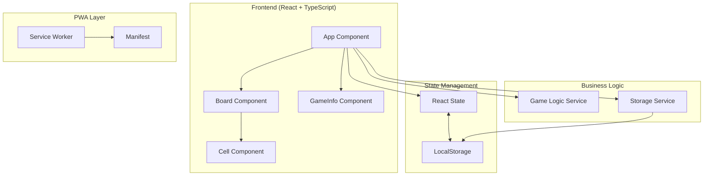
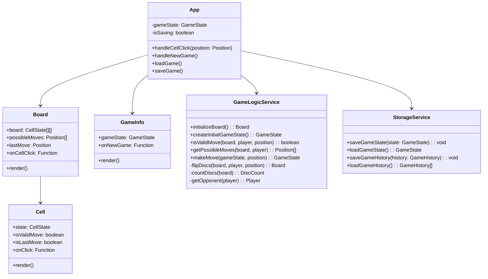
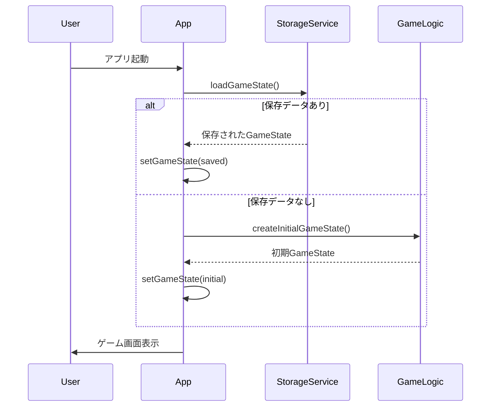
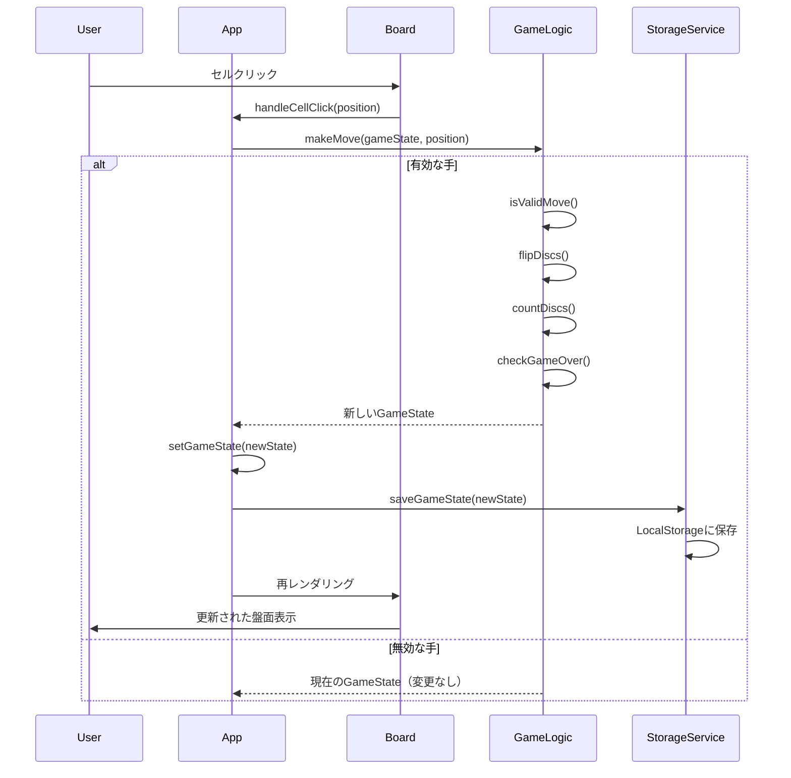
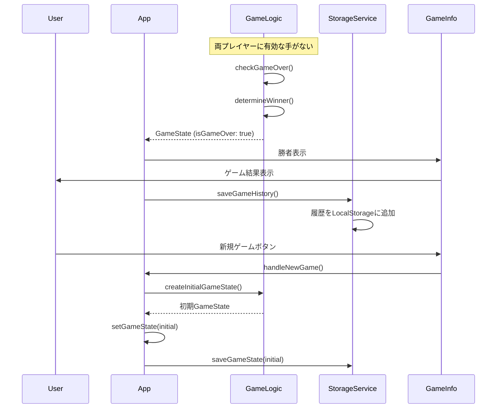

# 詳細設計書 - オフラインオセロアプリ

## アーキテクチャ設計

### システム構成図


### 技術スタック詳細
- **Frontend**: 
  - React 18.3 (関数コンポーネント + Hooks)
  - TypeScript 5.6 (厳密な型チェック)
  - Vite 6.0 (高速ビルドツール)
  - CSS Modules (スタイル管理)
- **State Management**: 
  - React State (useState, useEffect)
  - LocalStorage API (永続化)
- **オフライン対応**:
  - Progressive Web App (PWA)
  - Service Worker (キャッシュ戦略)
  - LocalStorage (ゲーム状態の自動保存)
- **ビルド・開発ツール**:
  - Vite (開発サーバー、ビルド)
  - ESLint (コード品質)
  - TypeScript Compiler (型チェック)

## API設計（将来のオンライン機能用）

### エンドポイント一覧
| メソッド | パス | 説明 | 認証 |
|---------|------|------|------|
| POST | /api/games | 新規ゲーム作成 | 任意 |
| GET | /api/games/:id | ゲーム状態取得 | 不要 |
| PUT | /api/games/:id/moves | 手を打つ | 要 |
| GET | /api/games/:id/history | ゲーム履歴取得 | 不要 |
| GET | /api/players/:id/stats | プレイヤー統計 | 要 |
| POST | /api/players | プレイヤー登録 | 不要 |

### API詳細

#### POST /api/games
- **説明**: 新規オンラインゲームを作成
- **リクエスト**: 
  ```json
  {
    "playerName": "Player1",
    "roomCode": "ABC123" // オプション：既存ルームに参加
  }
  ```
- **レスポンス**:
  ```json
  {
    "gameId": "550e8400-e29b-41d4-a716-446655440000",
    "roomCode": "ABC123",
    "players": {
      "black": "Player1",
      "white": null // 対戦相手待ち
    },
    "gameState": {
      "board": [[...]],
      "currentPlayer": "black",
      "blackCount": 2,
      "whiteCount": 2
    }
  }
  ```

#### PUT /api/games/:id/moves
- **説明**: 手を打つ
- **リクエスト**:
  ```json
  {
    "playerId": "550e8400-e29b-41d4-a716-446655440001",
    "position": {
      "row": 3,
      "col": 2
    }
  }
  ```
- **レスポンス**:
  ```json
  {
    "success": true,
    "gameState": {
      "board": [[...]],
      "currentPlayer": "white",
      "blackCount": 4,
      "whiteCount": 1,
      "lastMove": { "row": 3, "col": 2 }
    }
  }
  ```


## データベース設計

### ER図
```mermaid
erDiagram
    Players ||--o{ Games : plays
    Games ||--o{ Moves : contains
    Players ||--o{ GameStats : has
    
    Players {
        uuid id PK
        string name UK
        string email
        datetime created_at
        datetime last_active
    }
    
    Games {
        uuid id PK
        uuid black_player_id FK
        uuid white_player_id FK
        string room_code
        enum status
        uuid winner_id FK
        int black_count
        int white_count
        json final_board
        datetime started_at
        datetime finished_at
    }
    
    Moves {
        uuid id PK
        uuid game_id FK
        int move_number
        enum player
        int row
        int col
        json board_after
        datetime played_at
    }
    
    GameStats {
        uuid player_id PK FK
        int total_games
        int wins_as_black
        int wins_as_white
        int draws
        int total_discs_captured
        float avg_game_duration
        datetime updated_at
    }
```

### インデックス設計
- Games: room_code (UNIQUE), status, started_at DESC
- Moves: (game_id, move_number)
- GameStats: player_id (PRIMARY)

### LocalStorage スキーマ（現在の実装）
```typescript
interface LocalStorageSchema {
  'othello-game-state': GameState;
  'othello-game-history': GameHistory[];
  'othello-preferences': {
    showPossibleMoves: boolean;
    soundEnabled: boolean;
    theme: 'light' | 'dark';
  };
}
```

## クラス設計

### クラス図


### 主要な型定義
```typescript
// 基本型
type Player = 'black' | 'white';
type CellState = Player | null;
type Board = CellState[][];

// ゲーム関連の型
interface Position {
  row: number;
  col: number;
}

interface GameState {
  board: Board;
  currentPlayer: Player;
  blackCount: number;
  whiteCount: number;
  isGameOver: boolean;
  winner: Player | 'draw' | null;
  possibleMoves: Position[];
  lastMove: Position | null;
}

interface GameHistory {
  id: string;
  date: Date;
  winner: Player | 'draw';
  blackCount: number;
  whiteCount: number;
  moves: Position[];
}

// コンポーネントProps
interface BoardProps {
  board: Board;
  possibleMoves: Position[];
  lastMove: Position | null;
  onCellClick: (position: Position) => void;
}

interface CellProps {
  state: CellState;
  isValidMove: boolean;
  isLastMove: boolean;
  onClick: () => void;
}

interface GameInfoProps {
  gameState: GameState;
  onNewGame: () => void;
}
```

## シーケンス図

### ゲーム開始フロー


### 手を打つフロー


### ゲーム終了フロー


## パフォーマンス最適化

### レンダリング最適化
- React.memoによるコンポーネントの再レンダリング防止
- useCallbackによるイベントハンドラのメモ化
- 盤面の差分更新のみ実行

### ストレージ最適化
- デバウンスによる保存頻度の制限（500ms）
- 必要最小限のデータのみ保存
- 古い履歴の自動削除（最新10ゲーム）

## セキュリティ考慮事項

### クライアントサイド
- XSS対策: Reactの自動エスケープ機能を活用
- LocalStorageデータの検証とサニタイズ
- 不正な入力値のバリデーション

### 将来のオンライン機能
- JWT認証の実装
- APIレート制限
- WebSocket通信のセキュア化
- ゲームロジックのサーバーサイド検証

## エラー処理設計

### エラーケース
1. **LocalStorage アクセスエラー**
   - フォールバック: メモリ内でのゲーム継続
   - ユーザー通知: 保存機能の一時的な無効化を通知

2. **不正なゲーム状態**
   - 検証: ゲーム状態の整合性チェック
   - 復旧: 初期状態へのリセット

3. **PWAインストールエラー**
   - グレースフルデグレード: 通常のWebアプリとして動作継続

## 次のステップ

1. **実装フェーズ**
   - コンポーネントの詳細実装
   - ユニットテストの作成
   - E2Eテストの実装

2. **最適化フェーズ**
   - パフォーマンスチューニング
   - アクセシビリティ対応
   - 多言語対応

3. **拡張フェーズ**
   - AI対戦機能
   - オンライン対戦機能
   - リプレイ機能