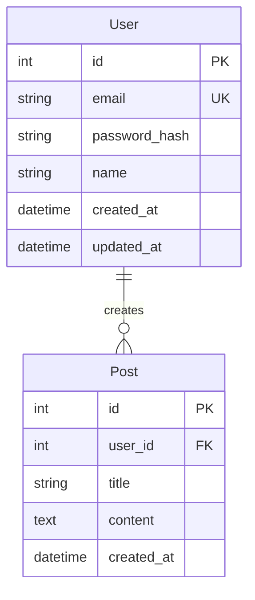
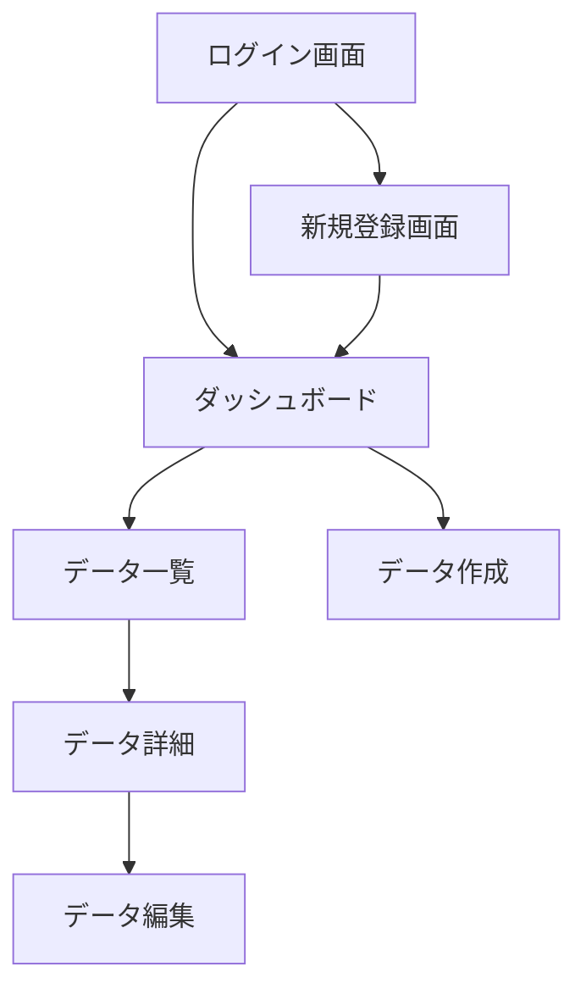

# 要件定義フェーズ

## 目的
MVP機能の詳細な要件を定義し、実装可能な仕様書を作成する。

## タスク
1. 各機能の詳細仕様作成
2. データモデルの設計
3. API仕様の定義
4. 画面遷移とUIの設計
5. エラー処理とバリデーション規則

## 入力
- 企画書（01_planning_result.md）
- 技術調査結果（02_research_result.md）

## 処理内容
各MVP機能について、実装に必要な詳細を定義してください：

### 1. 機能詳細
各機能について以下を明確化：
- 入力項目と型
- 処理ロジック
- 出力形式
- エラーケース

### 2. データベース設計
- エンティティと属性
- リレーションシップ
- インデックス設計

### 3. API設計
- エンドポイント一覧
- リクエスト/レスポンス形式
- 認証要件

## 出力フォーマット
```markdown
# 要件定義書

## 機能要件詳細
### 1. ユーザー管理機能
#### 1.1 ユーザー登録
- **入力項目**:
  - メールアドレス（必須、Email形式）
  - パスワード（必須、8文字以上）
  - 名前（必須、50文字以内）
- **処理**:
  1. 入力値のバリデーション
  2. メールアドレスの重複チェック
  3. パスワードのハッシュ化
  4. DBへの保存
- **出力**: 登録完了メッセージ、自動ログイン

### 2. [他の機能も同様に記載]

## データモデル
### ER図


## API仕様
### 認証API
| メソッド | パス | 説明 | 認証 |
|---------|------|------|------|
| POST | /api/auth/register | ユーザー登録 | 不要 |
| POST | /api/auth/login | ログイン | 不要 |
| POST | /api/auth/logout | ログアウト | 必要 |

### [各APIの詳細仕様]

## 画面遷移


## エラー処理
| エラーコード | 説明 | 対処法 |
|------------|------|--------|
| E001 | メールアドレス重複 | 別のメールアドレスを使用 |
| E002 | 認証エラー | ログイン情報を確認 |

## 非機能要件
- レスポンスタイム: 95%が1秒以内
- 可用性: 99.9%
- データバックアップ: 日次

## 次のステップ
1. この要件に基づいてプロトタイプを実装
2. 動作確認と要件の妥当性検証
```

## 実行例
```bash
cat 03_requirements.md ../results/01_planning_result.md ../results/02_research_result.md | claude --print --dangerously-skip-permissions --allowedTools 'Bash Write Edit MultiEdit Read LS Glob Grep' > ../results/03_requirements_result.md
```
