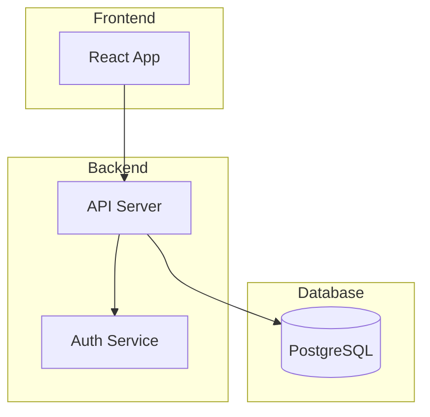
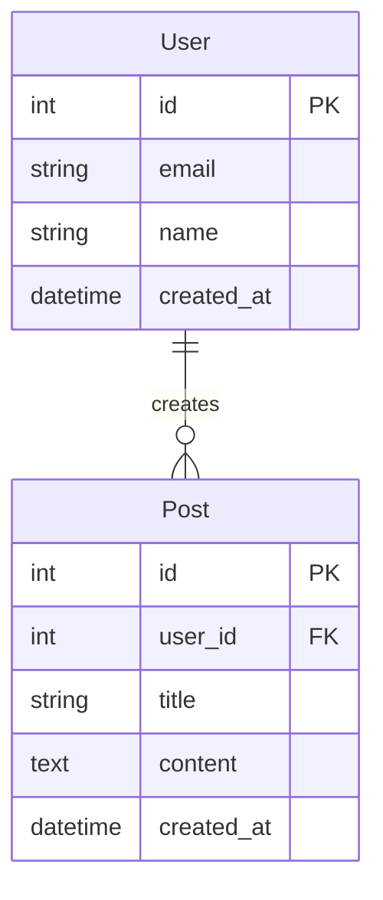
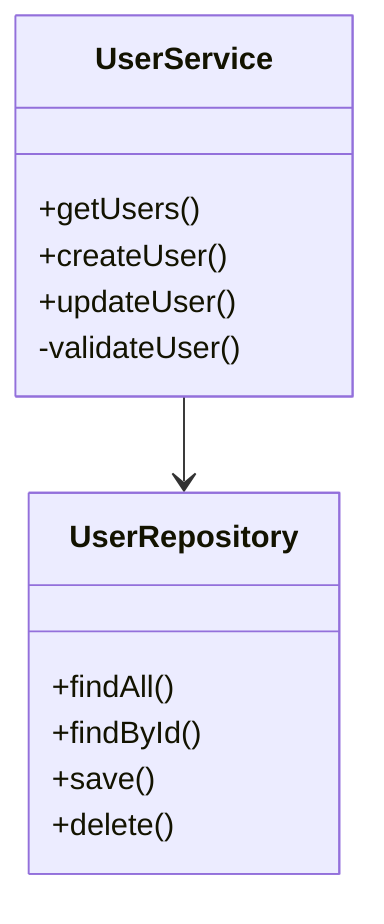
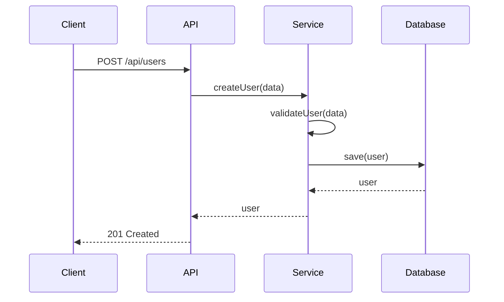

# 詳細設計フェーズ

## 目的
要件定義を基に、実装可能な詳細設計を作成する。

## タスク
1. アーキテクチャ設計
2. API設計
3. データベース設計
4. クラス設計
5. シーケンス図作成

## 入力
- 要件定義書（02_requirements_result.md）
- 技術制約（オプション）

## 出力フォーマット
```markdown
# 詳細設計書

## アーキテクチャ設計
### システム構成図


### 技術スタック詳細
- **Frontend**: [詳細技術]
- **Backend**: [詳細技術]
- **インフラ**: [詳細技術]

## API設計
### エンドポイント一覧
| メソッド | パス | 説明 | 認証 |
|---------|------|------|------|
| GET | /api/users | ユーザー一覧取得 | 要 |
| POST | /api/users | ユーザー作成 | 要 |

### API詳細
#### GET /api/users
- **説明**: ユーザー一覧を取得
- **リクエスト**: 
  ```json
  {
    "page": 1,
    "limit": 10
  }
  ```
- **レスポンス**:
  ```json
  {
    "users": [...],
    "total": 100
  }
  ```

## データベース設計
### ER図


## クラス設計
### クラス図


## シーケンス図
### ユーザー作成フロー

```

## 実行例
```bash
claude --file 03_design.md --file ../results/02_requirements_result.md > ../results/03_design_result.md
```