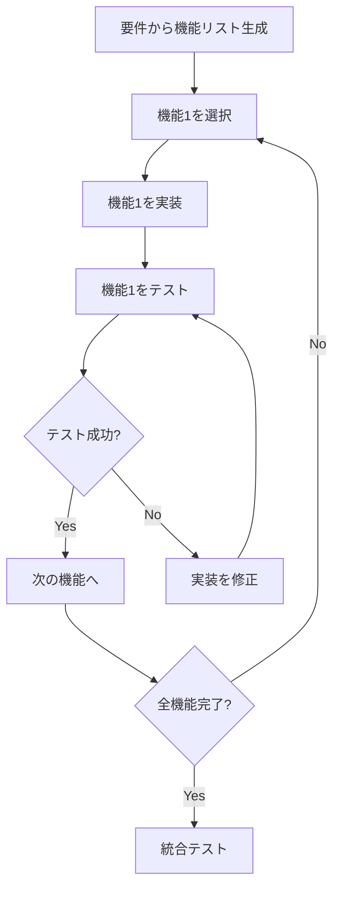

# 実装フェーズ（インクリメンタル版）

## 目的
機能を1つずつ実装し、各機能の実装後に即座にテストを実行することで、品質を保ちながら開発を進める。

## アプローチ
1. **機能の分割** - 要件を個別の実装可能な単位に分割
2. **依存関係の管理** - 実装順序を依存関係に基づいて決定
3. **即時テスト** - 各機能実装後に自動テスト実行
4. **継続的修正** - テスト失敗時は即座に修正

## 実装フロー


## 実行方法
### 通常モード（対話的）
```bash
# 各機能の実装後に確認しながら進める
./scripts/incremental-implementation.sh
```

### 自動モード
```bash
# すべての機能を自動で実装・テスト
./scripts/incremental-implementation.sh --auto
```

## 機能実装の優先順位
1. **基盤機能** - データベース接続、認証基盤
2. **コア機能** - CRUD操作、主要ビジネスロジック
3. **UI機能** - フロントエンド画面、フォーム
4. **拡張機能** - 通知、レポート、外部連携

## テスト戦略
### 各機能のテスト
- **ユニットテスト** - 個別関数の動作確認
- **APIテスト** - エンドポイントの動作確認
- **UIテスト** - 画面操作の動作確認

### テスト基準
- カバレッジ: 80%以上
- エラーケース: 必須
- エッジケース: 推奨

## 成果物
各機能ごとに以下を生成：
1. **実装コード**
   - フロントエンド: `frontend/src/features/[機能ID]/`
   - バックエンド: `backend/src/features/[機能ID]/`
2. **テストコード**
   - `tests/[機能ID]/`
3. **テスト結果**
   - `tests/[機能ID]_test_result.md`

## 利点
- 🔄 **早期フィードバック** - 問題を即座に発見
- ✅ **品質保証** - 各機能が確実に動作
- 📊 **進捗可視化** - 完了した機能が明確
- 🛠️ **デバッグ容易** - 問題の範囲が限定的

## 実行例
```bash
# 要件定義と設計書から自動で機能を抽出して実装
./scripts/incremental-implementation.sh ../results/03_requirements_result.md ../results/05_design_result.md
```