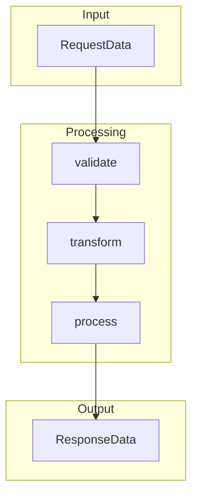

# 関数仕様書テンプレート

## 概要
[機能の目的と価値を1文で記述]

## アーキテクチャ


## 関数定義

### 1. メイン関数
```typescript
/**
 * [関数の主要な目的]
 * 
 * @param {RequestType} request - [入力データの説明]
 * @param {Context} context - 実行コンテキスト（オプション）
 * @returns {Promise<ResponseType>} [出力データの説明]
 * @throws {ValidationError} 入力データが不正な場合
 * @throws {ProcessingError} 処理中にエラーが発生した場合
 * 
 * @example
 * ```typescript
 * const result = await processFeature({
 *   id: '123',
 *   data: { name: 'test' }
 * });
 * console.log(result); // { success: true, id: '123' }
 * ```
 */
export const processFeature = async (
  request: RequestType,
  context?: Context
): Promise<ResponseType> => {
  return pipe(
    validate(requestSchema),
    transform,
    process(context),
    formatResponse
  )(request);
};
```

### 2. 型定義
```typescript
// 入力型
export interface RequestType {
  id: string;
  data: {
    name: string;
    value?: number;
  };
  options?: RequestOptions;
}

// 出力型
export interface ResponseType {
  success: boolean;
  id: string;
  result?: ProcessedData;
  error?: ErrorDetail;
}

// オプション型
interface RequestOptions {
  timeout?: number;
  retries?: number;
}

// エラー型
interface ErrorDetail {
  code: string;
  message: string;
  details?: unknown;
}
```

### 3. バリデーション関数
```typescript
/**
 * 入力データのバリデーション
 */
const requestSchema = z.object({
  id: z.string().uuid(),
  data: z.object({
    name: z.string().min(1).max(100),
    value: z.number().optional()
  }),
  options: z.object({
    timeout: z.number().min(0).max(30000),
    retries: z.number().min(0).max(3)
  }).optional()
});

export const validate = <T>(schema: z.ZodSchema<T>) => 
  (data: unknown): T => {
    const result = schema.safeParse(data);
    if (!result.success) {
      throw new ValidationError(result.error);
    }
    return result.data;
  };
```

### 4. 変換関数
```typescript
/**
 * データの前処理と正規化
 */
const transform = (validated: RequestType): NormalizedData => ({
  ...validated,
  data: {
    ...validated.data,
    name: validated.data.name.trim().toLowerCase(),
    value: validated.data.value ?? 0
  },
  timestamp: Date.now()
});
```

### 5. 処理関数
```typescript
/**
 * メインのビジネスロジック
 */
const process = (context?: Context) => 
  async (normalized: NormalizedData): Promise<ProcessedData> => {
    // ビジネスロジックの実装
    const result = await context?.db.save(normalized);
    return {
      id: result.id,
      processedAt: new Date()
    };
  };
```

### 6. 合成パターン
```typescript
// 関数合成ユーティリティ
export const pipe = <T>(...fns: Array<(arg: any) => any>) =>
  (value: T) => fns.reduce((acc, fn) => fn(acc), value);

// エラーハンドリング付き合成
export const safePipe = <T>(...fns: Array<(arg: any) => any>) =>
  async (value: T) => {
    try {
      return await pipe(...fns)(value);
    } catch (error) {
      logger.error('Pipeline error:', error);
      throw new ProcessingError('Pipeline failed', { cause: error });
    }
  };
```

## データフロー

### 正常系フロー
1. **入力受付** → RequestTypeで受け取る
2. **バリデーション** → zodスキーマで検証
3. **変換** → データの正規化
4. **処理** → ビジネスロジック実行
5. **整形** → ResponseType形式で返却

### エラーフロー
1. **バリデーションエラー** → 400 Bad Request
2. **処理エラー** → 500 Internal Server Error
3. **タイムアウト** → 408 Request Timeout

## エラーハンドリング

| エラー種別 | 発生条件 | HTTPステータス | 対処法 |
|-----------|---------|---------------|--------|
| ValidationError | 入力が不正 | 400 | エラー詳細を返す |
| NotFoundError | リソースなし | 404 | 存在しないことを通知 |
| ProcessingError | 処理失敗 | 500 | リトライまたはエラー通知 |
| TimeoutError | タイムアウト | 408 | リトライ推奨 |

## パフォーマンス特性

### 計算量
- **時間計算量**: O(n) - データサイズに比例
- **空間計算量**: O(1) - 定数メモリ使用

### 最適化
- **キャッシュ**: 頻繁なクエリはRedisでキャッシュ
- **バッチ処理**: 大量データは分割処理
- **並列化**: 独立した処理は並列実行

## テスト戦略

### 1. 単体テスト
```typescript
describe('processFeature', () => {
  it('should process valid input correctly', async () => {
    const input = { id: '123', data: { name: 'test' } };
    const result = await processFeature(input);
    expect(result.success).toBe(true);
  });
});
```

### 2. プロパティベーステスト
```typescript
test.prop([fc.uuid(), fc.string()])
  ('should handle any valid id and name', async (id, name) => {
    const result = await processFeature({ id, data: { name } });
    expect(result.id).toBe(id);
  });
```

### 3. エラーケーステスト
```typescript
it('should throw ValidationError for invalid input', async () => {
  await expect(processFeature({ id: 'invalid' }))
    .rejects.toThrow(ValidationError);
});
```

## 使用例

### 基本的な使用
```typescript
// シンプルな呼び出し
const result = await processFeature({
  id: '550e8400-e29b-41d4-a716-446655440000',
  data: { name: 'Example Item' }
});
```

### オプション付き使用
```typescript
// タイムアウトとリトライ設定
const result = await processFeature({
  id: '550e8400-e29b-41d4-a716-446655440000',
  data: { name: 'Example Item', value: 42 },
  options: {
    timeout: 5000,
    retries: 2
  }
});
```

### エラーハンドリング
```typescript
try {
  const result = await processFeature(request);
  console.log('Success:', result);
} catch (error) {
  if (error instanceof ValidationError) {
    console.error('Invalid input:', error.details);
  } else if (error instanceof ProcessingError) {
    console.error('Processing failed:', error.message);
  } else {
    console.error('Unexpected error:', error);
  }
}
```

## 依存関係

### 外部ライブラリ
- `zod`: ^3.0.0 - スキーマバリデーション
- `fp-ts`: ^2.0.0 - 関数型プログラミングユーティリティ（オプション）

### 内部モジュール
- `@shared/patterns` - 共通パターンライブラリ
- `@shared/errors` - カスタムエラークラス
- `@shared/logger` - ロギングユーティリティ

## 拡張ポイント

### ミドルウェアパターン
```typescript
// カスタムミドルウェアの追加
const withLogging = (fn: Function) => async (...args: any[]) => {
  logger.info('Function called:', fn.name, args);
  const result = await fn(...args);
  logger.info('Function completed:', fn.name, result);
  return result;
};

// 使用例
export const processFeatureWithLogging = withLogging(processFeature);
```

### プラグインシステム
```typescript
// プラグインインターフェース
interface ProcessPlugin {
  beforeValidate?: (data: unknown) => unknown;
  afterValidate?: (data: RequestType) => RequestType;
  beforeProcess?: (data: NormalizedData) => NormalizedData;
  afterProcess?: (result: ProcessedData) => ProcessedData;
}

// プラグイン適用
const withPlugins = (plugins: ProcessPlugin[]) => 
  (fn: Function) => (...args: any[]) => {
    // プラグイン処理の実装
  };
```