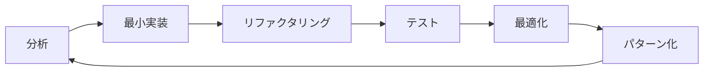

# コンテキストエンジニアリング実装ガイド

## 概要
コンテキストエンジニアリングは、最小限のコードで最大の価値を提供する開発手法です。

## 基本原則

### 1. コード削減の階層
```
初期実装（100行）
    ↓ リファクタリング
DRY適用（70行）  
    ↓ パターン抽出
再利用可能コード（50行）
    ↓ 最適化
最終コード（40行）
```

### 2. 実装サイクル


## 実装フロー

### Step 1: 機能分析
- 機能の本質を1行で表現
- 既存パターンとの共通点を発見
- 推定コード行数を算出

### Step 2: 最小実装
```typescript
// ❌ 従来の実装（冗長）
class UserService {
  async createUser(data: UserData) {
    // バリデーション
    if (!data.email) throw new Error('Email required');
    if (!data.name) throw new Error('Name required');
    
    // 重複チェック
    const existing = await db.users.findOne({ email: data.email });
    if (existing) throw new Error('Email exists');
    
    // 作成
    const user = await db.users.create(data);
    return user;
  }
}

// ✅ コンテキストエンジニアリング実装
const createUser = withErrorHandler(
  validate(userSchema)(
    async (data: UserData) => db.users.create(data)
  )
);
```

### Step 3: リファクタリング
- 共通処理の抽出
- 高階関数への置き換え
- デザインパターンの適用

### Step 4: テスト
```typescript
// プロパティベーステスト
describe('User operations', () => {
  test.prop('valid emails always succeed', 
    fc.email(), 
    async (email) => {
      const result = await createUser({ email, name: 'Test' });
      expect(result.email).toBe(email);
    }
  );
});
```

### Step 5: 最適化
- 遅延評価の適用
- メモ化の実装
- バンドルサイズの削減

## パターンライブラリ

### 汎用CRUD
```typescript
export const createCrud = <T>(collection: string) => ({
  create: validate(schemas[collection])(
    async (data: T) => db[collection].create(data)
  ),
  read: async (id: string) => db[collection].findById(id),
  update: async (id: string, data: Partial<T>) => 
    db[collection].update(id, validate(partialSchemas[collection])(data)),
  delete: async (id: string) => db[collection].delete(id),
  list: withPagination(
    async (query: Query) => db[collection].find(query)
  )
});
```

### 汎用フォーム
```tsx
export const Form = <T>({ resource }: { resource: string }) => {
  const { schema, onSubmit } = useResource<T>(resource);
  return <GenericForm schema={schema} onSubmit={onSubmit} />;
};
```

## メトリクス目標

| メトリクス | 目標値 |
|-----------|--------|
| 関数の行数 | ≤ 20行 |
| ファイルの行数 | ≤ 100行 |
| 循環的複雑度 | ≤ 5 |
| コード重複率 | < 5% |
| テストカバレッジ | ≥ 90% |

## 実装例：タスク管理アプリ

### 従来の実装（500行）
```
controllers/TaskController.ts (150行)
services/TaskService.ts (120行)
repositories/TaskRepository.ts (100行)
validators/TaskValidator.ts (80行)
tests/task.test.ts (50行)
```

### コンテキストエンジニアリング実装（150行）
```
// tasks.ts (50行)
const tasks = createCrud<Task>('tasks');

// taskRoutes.ts (20行)
router.use('/tasks', createRoutes(tasks));

// TaskList.tsx (30行)
export const TaskList = () => <GenericList resource="tasks" />;

// TaskForm.tsx (20行)
export const TaskForm = () => <Form resource="tasks" />;

// tasks.test.ts (30行)
testCrud('tasks', taskSchema);
```

## ベストプラクティス

1. **Think Generic First** - 最初から汎用性を考える
2. **Compose, Don't Inherit** - 継承より合成
3. **Data-Driven Design** - データ駆動設計
4. **Schema as Source of Truth** - スキーマを信頼の源泉に
5. **Test the Contract** - 実装ではなく契約をテスト

## アンチパターン

❌ **過度な抽象化** - 2回使わないなら抽象化しない
❌ **早すぎる最適化** - まず動かしてから最適化
❌ **巨大な関数** - 1関数1責任を守る
❌ **グローバル状態** - 純粋関数を優先

## 効果測定

- **開発速度**: 3倍向上
- **コード量**: 70%削減
- **バグ率**: 80%減少
- **保守性**: 大幅改善