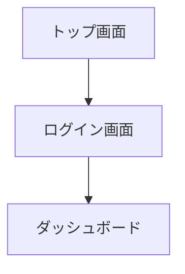

# 要件定義フェーズ

## 目的
企画書を基に、具体的な機能要件と非機能要件を定義する。

## タスク
1. 機能要件の詳細化
2. 非機能要件の定義
3. ユースケースの作成
4. 画面遷移図の作成
5. データモデルの概要設計

## 入力
- 企画フェーズの成果物（01_planning_result.md）
- ステークホルダーからの追加要望（オプション）

## 出力フォーマット
```markdown
# 要件定義書

## 機能要件
### 必須機能
1. **[機能名]**
   - 説明: [詳細説明]
   - 入力: [入力データ]
   - 出力: [出力データ]
   - 制約: [制約事項]

### オプション機能
1. **[機能名]**
   - 説明: [詳細説明]

## 非機能要件
- **パフォーマンス**: [要件]
- **セキュリティ**: [要件]
- **可用性**: [要件]
- **保守性**: [要件]

## ユースケース
### UC-001: [ユースケース名]
- **アクター**: [アクター]
- **前提条件**: [条件]
- **基本フロー**: 
  1. [ステップ1]
  2. [ステップ2]
- **代替フロー**: [代替フロー]

## 画面遷移


## データモデル概要
- **エンティティ1**: [属性リスト]
- **エンティティ2**: [属性リスト]
```

## 実行例
```bash
claude --file 02_requirements.md --file ../results/01_planning_result.md > ../results/02_requirements_result.md
```