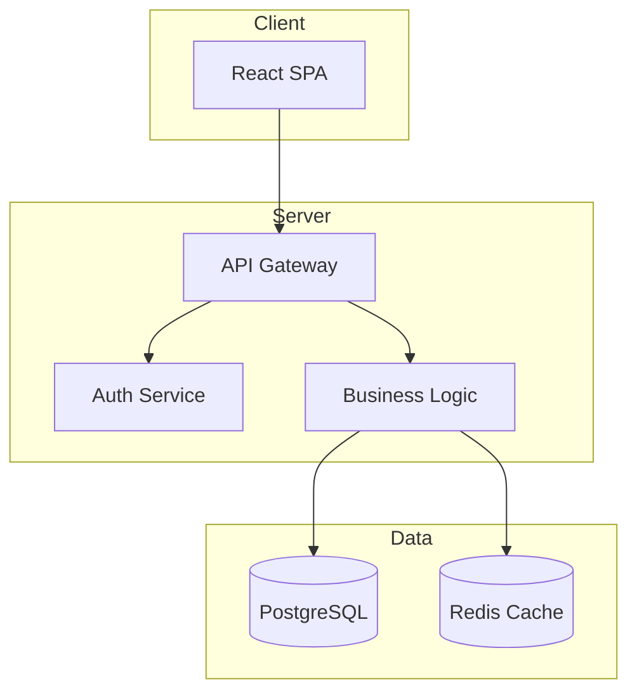

# ドキュメント生成フェーズ

## 目的
プロジェクトの技術仕様、API仕様、運用手順などの包括的なドキュメントを生成する。

## タスク
1. API仕様書の自動生成
2. 技術仕様書の作成
3. 運用マニュアルの作成
4. ユーザーガイドの作成
5. トラブルシューティングガイドの作成

## 入力
- 実装コード（06_implementation_result.md）
- テスト結果（07_testing_result.md）
- レビュー結果（08_code_review_result.md）

## 出力フォーマット
```markdown
# プロジェクトドキュメント

## 目次
1. [概要](#概要)
2. [アーキテクチャ](#アーキテクチャ)
3. [API仕様](#api仕様)
4. [セットアップガイド](#セットアップガイド)
5. [運用マニュアル](#運用マニュアル)
6. [トラブルシューティング](#トラブルシューティング)

## 概要
### プロジェクト情報
- **プロジェクト名**: [名前]
- **バージョン**: 1.0.0
- **最終更新日**: [日付]
- **技術スタック**: React, Node.js, PostgreSQL

### システム概要
[システムの目的と主要機能の説明]

## アーキテクチャ
### システム構成図


### ディレクトリ構造
```
project/
├── frontend/          # フロントエンドアプリケーション
│   ├── src/
│   │   ├── components/   # UIコンポーネント
│   │   ├── hooks/        # カスタムフック
│   │   ├── services/     # API通信
│   │   └── utils/        # ユーティリティ
│   └── public/
├── backend/           # バックエンドAPI
│   ├── src/
│   │   ├── controllers/  # HTTPハンドラ
│   │   ├── services/     # ビジネスロジック
│   │   ├── models/       # データモデル
│   │   └── middleware/   # ミドルウェア
│   └── tests/
└── docs/             # ドキュメント
```

## API仕様
### 認証API
#### POST /api/auth/login
ユーザーログイン

**リクエスト**
```json
{
  "email": "user@example.com",
  "password": "password123"
}
```

**レスポンス**
```json
{
  "token": "eyJhbGciOiJIUzI1NiIs...",
  "user": {
    "id": 1,
    "email": "user@example.com",
    "name": "User Name"
  }
}
```

**エラーレスポンス**
- 401: 認証失敗
- 400: リクエスト不正

### リソースAPI
#### GET /api/items
アイテム一覧取得

**パラメータ**
| 名前 | 型 | 必須 | 説明 |
|------|-----|------|------|
| page | number | No | ページ番号 (default: 1) |
| limit | number | No | 取得件数 (default: 20) |
| sort | string | No | ソート項目 |

**レスポンス**
```json
{
  "items": [...],
  "pagination": {
    "page": 1,
    "limit": 20,
    "total": 100
  }
}
```

## セットアップガイド
### 前提条件
- Node.js v18以上
- PostgreSQL 14以上
- Redis 6以上

### インストール手順
1. **リポジトリのクローン**
   ```bash
   git clone https://github.com/org/project.git
   cd project
   ```

2. **依存関係のインストール**
   ```bash
   # Frontend
   cd frontend && npm install
   
   # Backend
   cd ../backend && npm install
   ```

3. **環境変数の設定**
   ```bash
   cp .env.example .env
   # .envファイルを編集
   ```

4. **データベースのセットアップ**
   ```bash
   npm run db:migrate
   npm run db:seed
   ```

5. **起動**
   ```bash
   npm run dev
   ```

## 運用マニュアル
### デプロイメント
```bash
# プロダクションビルド
npm run build

# デプロイ
npm run deploy:production
```

### 監視設定
- **アプリケーション監視**: DataDog/New Relic
- **ログ管理**: CloudWatch Logs
- **メトリクス**: Prometheus + Grafana

### バックアップ
- **データベース**: 日次自動バックアップ
- **ファイルストレージ**: S3への同期

## トラブルシューティング
### よくある問題

#### 問題: ログインできない
**原因と対策**:
1. Cookieが無効 → ブラウザ設定を確認
2. トークン期限切れ → 再ログイン
3. CORS設定 → 環境変数ALLOWED_ORIGINSを確認

#### 問題: APIレスポンスが遅い
**原因と対策**:
1. N+1クエリ → ログを確認しクエリ最適化
2. キャッシュミス → Redis接続を確認
3. 大量データ → ページネーション実装

### ログの確認方法
```bash
# アプリケーションログ
docker logs app-container

# データベースログ
docker logs db-container

# エラーログのフィルタリング
docker logs app-container 2>&1 | grep ERROR
```

### 緊急時の対応
1. **サービス停止時**
   ```bash
   # ヘルスチェック
   curl http://api.example.com/health
   
   # サービス再起動
   docker-compose restart
   ```

2. **データベース接続エラー**
   ```bash
   # 接続テスト
   psql -h localhost -U user -d database
   
   # 接続プール確認
   ```

## 付録
### 環境変数一覧
| 変数名 | 説明 | デフォルト値 |
|--------|------|-------------|
| NODE_ENV | 実行環境 | development |
| DATABASE_URL | DB接続文字列 | - |
| REDIS_URL | Redis接続文字列 | - |
| JWT_SECRET | JWT署名キー | - |

### 用語集
- **JWT**: JSON Web Token、認証トークン
- **SPA**: Single Page Application
- **CORS**: Cross-Origin Resource Sharing
```

## 実行例
```bash
claude --file 09_documentation.md --file ../results/06_implementation_result.md --file ../results/07_testing_result.md --file ../results/08_code_review_result.md > ../results/09_documentation_result.md
```