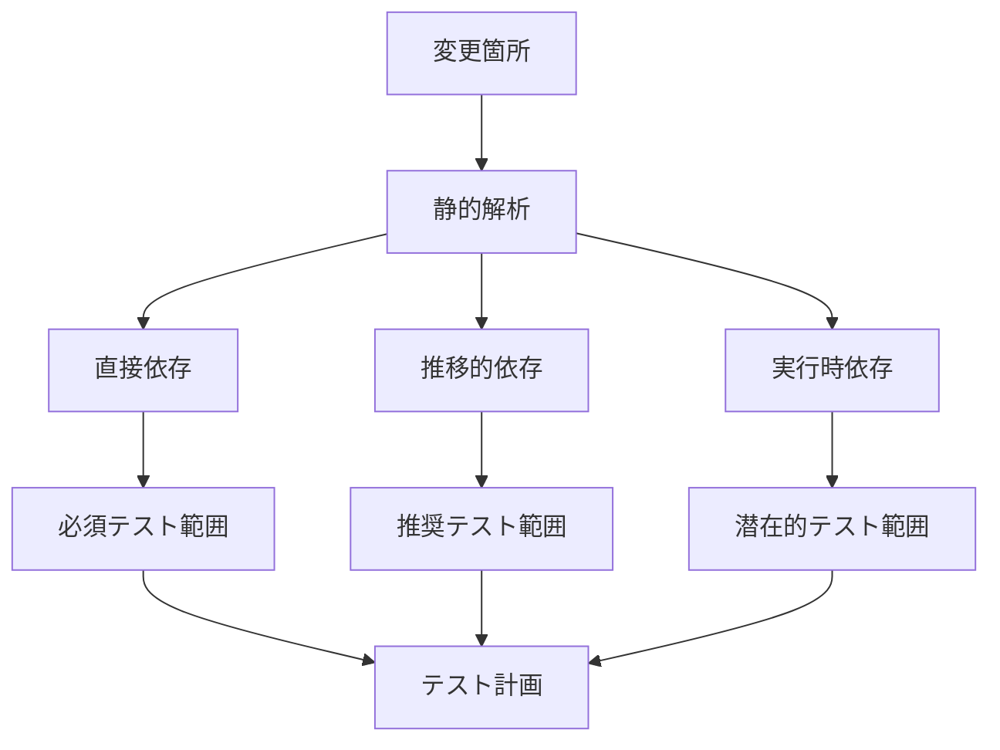

# 変更影響範囲を確実にカバーするテスト戦略

## 概要
変更箇所を中心に、その影響が及ぶ全範囲を特定し、確実にテストする戦略。

## 影響範囲分析フレームワーク

### 1. 変更タイプ別影響マップ
```yaml
変更タイプ:
  API変更:
    直接影響:
      - 呼び出し元コントローラー
      - クライアントコード
      - APIドキュメント
    間接影響:
      - キャッシュレイヤー
      - ログ/監視システム
      - 統合テスト
    
  データモデル変更:
    直接影響:
      - リポジトリ層
      - マイグレーション
      - シリアライゼーション
    間接影響:
      - APIレスポンス
      - バリデーション
      - 既存データとの互換性
    
  ビジネスロジック変更:
    直接影響:
      - 関連サービス
      - 状態管理
      - トランザクション
    間接影響:
      - パフォーマンス
      - 並行処理
      - エラーハンドリング
```

### 2. 影響範囲自動検出


## 変更影響テストの実装パターン

### 1. 依存関係追跡テンプレート
```yaml
# 変更前の依存関係記録
変更対象: AuthService.login()

依存関係マップ:
  呼び出し元:
    - AuthController.login() [直接]
    - UserService.authenticate() [直接]
    - AdminPanel.forceLogin() [間接]
  
  依存先:
    - UserRepository.findByEmail()
    - TokenService.generate()
    - EventBus.emit('user.login')
  
  副作用:
    - ログイン履歴記録
    - セッション作成
    - 統計情報更新

影響範囲:
  critical: [認証フロー全体]
  high: [ユーザー管理, 監査ログ]
  medium: [ダッシュボード, 通知]
  low: [統計, レポート]
```

### 2. スマートテストスコープ決定
```yaml
テストスコープ計算:
  # 入力: 変更ファイルリスト
  changed_files:
    - auth/AuthService.ts: login()メソッド
    - auth/types.ts: LoginDTO追加
  
  # 処理: 影響分析
  impact_analysis:
    level_1: # 直接影響（必須）
      - test/auth/AuthService.test.ts
      - test/auth/AuthController.test.ts
      - test/integration/login.test.ts
    
    level_2: # 1次依存（推奨）
      - test/user/UserService.test.ts
      - test/admin/AdminPanel.test.ts
      - test/e2e/auth-flow.test.ts
    
    level_3: # 2次依存（選択的）
      - test/dashboard/stats.test.ts
      - test/notification/alerts.test.ts

  # 出力: 優先順位付きテストリスト
  test_execution_order:
    1. 変更箇所の単体テスト
    2. 直接依存の統合テスト
    3. クリティカルパスのE2Eテスト
    4. 影響範囲の回帰テスト
```

## 影響ベーステスト生成

### 1. テストケース自動生成
```typescript
// 変更検出とテスト生成の例
interface ChangeImpactTest {
  // 変更前の振る舞いを記録
  baseline: {
    input: any[];
    output: any;
    sideEffects: string[];
  };
  
  // 変更後の期待値
  expected: {
    output: any;
    sideEffects: string[];
    compatibility: boolean;
  };
}

// テスト生成関数
function generateImpactTests(change: CodeChange): TestSuite {
  const impacts = analyzeImpact(change);
  
  return {
    // 直接影響テスト
    direct: impacts.direct.map(impact => ({
      name: `Direct impact: ${impact.component}`,
      test: () => validateDirectImpact(impact)
    })),
    
    // 間接影響テスト
    indirect: impacts.indirect.map(impact => ({
      name: `Indirect impact: ${impact.component}`,
      test: () => validateIndirectImpact(impact)
    })),
    
    // 回帰テスト
    regression: impacts.critical.map(path => ({
      name: `Regression: ${path}`,
      test: () => validateCriticalPath(path)
    }))
  };
}
```

### 2. 影響範囲の可視化
```yaml
影響マトリックス:
  AuthService.login():
    ├─ 直接呼び出し:
    │   ├─ AuthController.login() ← [TEST: 必須]
    │   └─ AuthMiddleware.refresh() ← [TEST: 必須]
    │
    ├─ データ影響:
    │   ├─ users.last_login ← [TEST: 必須]
    │   ├─ sessions.* ← [TEST: 必須]
    │   └─ audit_logs.* ← [TEST: 推奨]
    │
    └─ 機能影響:
        ├─ ダッシュボード表示 ← [TEST: 推奨]
        ├─ 通知システム ← [TEST: 選択的]
        └─ レポート生成 ← [TEST: 選択的]
```

## コンテキスト引き継ぎの最適化

### リファクタリング→テストの影響情報
```yaml
# 超圧縮影響サマリー（60トークン）
refactor→test:
  changed:
    AuthService.login(): 
      -validation inline
      +ValidationService.validate()
      impact: [→AuthController,→UserService,→sessions]
    
    TokenService.generate():
      -sync +async
      impact: [→all-auth-flow]
  
  critical-paths:
    - login→token→dashboard
    - refresh→validate→extend
  
  regression-focus:
    - session-consistency
    - token-expiry-handling
    - concurrent-login
```

## 実践的なテスト実行戦略

### 1. 段階的テスト実行
```bash
#!/bin/bash
# impact-based-test.sh

# Phase 1: 変更箇所の直接テスト
echo "Phase 1: Direct Impact Tests"
npm test -- auth/AuthService.test.ts
npm test -- auth/ValidationService.test.ts

# Phase 2: 影響範囲のテスト
echo "Phase 2: Impact Zone Tests"
npm test -- $(find-impacted-tests auth/AuthService.ts)

# Phase 3: クリティカルパステスト
echo "Phase 3: Critical Path Tests"
npm test -- e2e/auth-flow.test.ts
npm test -- integration/session.test.ts

# Phase 4: 回帰テスト（影響度順）
echo "Phase 4: Regression Tests"
npm test -- --grep "auth|session|token" --sort-by-impact
```

### 2. 影響度ベースの優先順位付け
```yaml
テスト優先順位:
  P0 (即座に実行):
    - 変更メソッドの単体テスト
    - 直接呼び出し元のテスト
    - 認証などのクリティカル機能
    
  P1 (必須):
    - 1次依存のテスト
    - データ整合性テスト
    - 主要な統合テスト
    
  P2 (推奨):
    - 2次依存のテスト
    - パフォーマンステスト
    - UI関連テスト
    
  P3 (選択的):
    - 3次以降の依存
    - 非機能要件テスト
```

## AIへの指示テンプレート

### 影響分析とテスト実行指示
```markdown
## 変更影響テスト実施指示

### 変更内容
- ファイル: auth/AuthService.ts
- メソッド: login()
- 変更: バリデーション処理を外部化

### タスク
1. **影響分析**
   - このメソッドを呼び出している箇所を特定
   - データベースへの影響を確認
   - 関連する機能をリストアップ

2. **テスト計画**
   - P0: 変更箇所の直接テスト
   - P1: 呼び出し元の統合テスト
   - P2: 影響を受ける機能のテスト

3. **実行と確認**
   - 優先度順にテストを実行
   - 失敗したら原因を特定
   - 100%の信頼性を確保

必要に応じて、影響範囲の特定のために検索を実施してください。
```

## メトリクスとレポート

### 影響カバレッジレポート
```yaml
変更影響カバレッジ:
  変更ファイル: 3
  
  影響範囲:
    直接影響: 8ファイル [100% tested]
    間接影響: 15ファイル [87% tested]
    潜在影響: 23ファイル [65% tested]
  
  テスト実行:
    P0: 12/12 ✓
    P1: 23/25 (92%)
    P2: 18/30 (60%)
    P3: 8/20 (40%)
  
  信頼性スコア: 94%
  推奨: P1の残り2テストを実行
```

## まとめ

変更影響中心のテスト戦略により：

1. **確実な品質保証**: 変更の影響範囲を漏れなくテスト
2. **効率的な実行**: 影響度に基づく優先順位付け
3. **リスク最小化**: クリティカルパスを重点的に検証
4. **最適なカバレッジ**: 必要十分なテストで100%の信頼性

変更箇所だけでなく、その波及効果まで確実にテストすることで、真の品質保証を実現します。