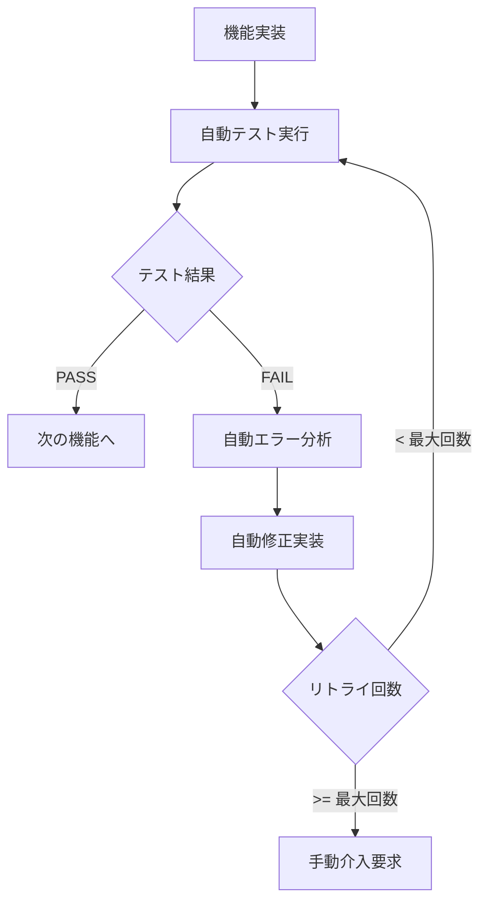

# 自動インクリメンタル実装ガイド

## 概要

自動インクリメンタル実装は、テスト失敗時に**人間の介入なしに自動的に修正を繰り返す**高度な実装モードです。

## 完全自動化の仕組み

### 基本フロー



### 自動修正ループ

```bash
# 最大5回まで自動リトライ
MAX_RETRY=5

while [ $retry_count -lt $MAX_RETRY ]; do
    # テスト実行
    run_tests
    
    if [ テスト失敗 ]; then
        # 自動修正
        auto_fix_implementation
        retry_count++
    else
        # 成功したら次へ
        break
    fi
done
```

## 実行モード

### 1. 完全自動モード（推奨）

```bash
# 起動時に選択
自動修正モードで実行しますか？ (y/n)
y: 自動修正（推奨）、n: 手動確認

# yを選択すると、すべての修正が自動実行
```

**特徴**：
- 人間の介入不要
- 最速で実装完了
- 夜間実行に最適

### 2. 半自動モード

```bash
# 各失敗時に確認
修正を試みますか？ (y/n/a)
y: はい
n: いいえ
a: 以降すべて自動修正  ← 途中から自動化
```

**特徴**：
- 最初は確認、途中から自動化可能
- 柔軟な制御
- 学習しながら実行

## 詳細な進捗表示

```
━━━━━━━━━━━━━━━━━━━━━━━━━━━━━━━━━━━━━━━━━
【進捗状況】
実装完了: 5/10 機能
テスト成功: 4 機能
テスト失敗: 1 機能
[==========          ] 50%
━━━━━━━━━━━━━━━━━━━━━━━━━━━━━━━━━━━━━━━━━
```

## 自動修正の戦略

### 1. エラー分析

```yaml
テスト失敗時の分析:
  1. エラーメッセージの解析
  2. 失敗したテストケースの特定
  3. 関連コードの特定
  4. 修正方針の決定
```

### 2. 段階的修正

```
第1回修正: 最小限の修正
  └→ エラー箇所のみ修正

第2回修正: 範囲拡大
  └→ 関連する処理も見直し

第3回修正: 設計見直し
  └→ アプローチの変更

第4回修正: リファクタリング
  └→ コード構造の改善

第5回修正: 最終手段
  └→ 別解の実装
```

### 3. 学習型改善

```yaml
修正パターンの蓄積:
  - 同じエラーパターンを記憶
  - 成功した修正方法を再利用
  - 修正効率の向上
```

## 実行例

### 成功パターン

```bash
$ ./auto-incremental-implementation.sh

自動修正モードで実行しますか？ (y/n) y
自動修正モードで実行します

実装中: ユーザー認証機能...
✅ 実装完了

テスト実行: ユーザー認証機能
テスト実行中...
❌ テスト失敗 (試行 1/5)
自動修正を実行中...
修正完了

再テスト実行 (1/5): ユーザー認証機能
テスト実行中...
❌ テスト失敗 (試行 2/5)
自動修正を実行中...
修正完了

再テスト実行 (2/5): ユーザー認証機能
テスト実行中...
✅ すべてのテストがパス
```

### 失敗パターン（手動介入必要）

```bash
再テスト実行 (5/5): ユーザー認証機能
テスト実行中...
❌ テスト失敗 (試行 5/5)
最大リトライ回数に達しました。手動での修正が必要です。
失敗の詳細: tests/auth_test_result.md
```

## 統計情報とサマリー

```
━━━━━━━━━━━━━━━━━━━━━━━━━━━━━━━━━━━━━━━━━
【実装サマリー】
━━━━━━━━━━━━━━━━━━━━━━━━━━━━━━━━━━━━━━━━━
総機能数: 10
成功: 8 (80%)
失敗: 2 (20%)
実行時間: 1234秒
━━━━━━━━━━━━━━━━━━━━━━━━━━━━━━━━━━━━━━━━━
```

## 設定オプション

### 環境変数での制御

```bash
# 最大リトライ回数を変更
export MAX_RETRY=10

# 自動修正を常に有効化
export AUTO_FIX=true

# タイムアウト設定（秒）
export CLAUDE_TIMEOUT=300
```

### スクリプト内での調整

```bash
# スクリプトの先頭で設定
MAX_RETRY=5          # リトライ回数
AUTO_FIX=true        # 自動修正モード
PARALLEL_TESTS=true  # 並列テスト実行
```

## ベストプラクティス

### 1. 大規模プロジェクトでの使用

```bash
# 夜間バッチ実行
nohup ./auto-incremental-implementation.sh > implementation.log 2>&1 &

# 進捗監視
tail -f implementation.log
```

### 2. CI/CDパイプラインへの統合

```yaml
# GitHub Actions例
- name: Run Auto Implementation
  run: |
    cd ClaudeFlow/scripts
    ./auto-incremental-implementation.sh
  env:
    AUTO_FIX: true
    MAX_RETRY: 3
```

### 3. エラー時の対処

```bash
# 失敗した機能のみ再実行
./auto-incremental-implementation.sh --retry-failed

# 特定機能のみ実行
./auto-incremental-implementation.sh --feature "user_auth"
```

## トラブルシューティング

### よくある問題

1. **無限ループ**
   - 原因：同じエラーが繰り返される
   - 対策：MAX_RETRYで制限

2. **メモリ不足**
   - 原因：大きなコンテキスト
   - 対策：機能を細分化

3. **タイムアウト**
   - 原因：複雑な修正
   - 対策：タイムアウト値を増加

## まとめ

自動インクリメンタル実装により：

1. **完全自動化** - 人間の介入を最小化
2. **高速開発** - 修正サイクルの自動化
3. **品質保証** - 最大5回の自動改善
4. **柔軟性** - 自動/手動モードの選択
5. **可視性** - 詳細な進捗とサマリー

これにより、大規模プロジェクトでも効率的に高品質なコードを生成できます。