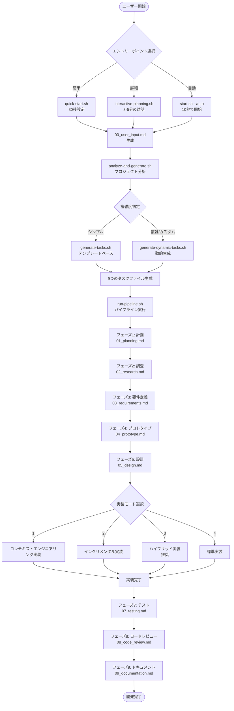

# ClaudeFlow アプリケーション開発フローチャート

## 📊 開発プロセス全体図



## 🚀 詳細な開発フロー

### 1. スタートアップフェーズ

#### 1.1 エントリーポイント（3つの選択肢）

```
┌─────────────────────────────────────────────────────┐
│ ClaudeFlowを開始する方法を選択してください：          │
├─────────────────────────────────────────────────────┤
│ 1. quick-start.sh    - 最速（30秒）               │
│    └→ アプリ名だけ入力、他はデフォルト値            │
│                                                    │
│ 2. interactive-planning.sh - 詳細（3-5分）         │
│    └→ 対話形式で要件を詳細に定義                   │
│                                                    │
│ 3. start.sh --auto   - 全自動（10秒）             │
│    └→ サンプルプロジェクトで即開始                  │
└─────────────────────────────────────────────────────┘
```

#### 1.2 ユーザー入力収集

**対話形式の質問内容：**
- プロジェクト名と説明
- ターゲットユーザー
- 必要な機能リスト
- 使用デバイス（PC/スマホ/タブレット）
- デザインの優先順位
- セキュリティ要件
- 開発期限

**出力：** `results/00_user_input.md`

### 2. 分析・生成フェーズ

#### 2.1 プロジェクト分析（analyze-and-generate.sh）

```
Claude による分析：
┌─────────────────────────────┐
│ 入力された要件を分析中...      │
├─────────────────────────────┤
│ ✓ アプリタイプ: ECサイト      │
│ ✓ 複雑度: 標準               │
│ ✓ 特殊要件: 決済システム      │
│ ✓ 推奨アプローチ: 動的生成    │
└─────────────────────────────┘
```

#### 2.2 タスク生成

**テンプレートベース（generate-tasks.sh）：**
- 標準的な9つのタスクテンプレートを使用
- ユーザー入力に基づいてカスタマイズ

**動的生成（generate-dynamic-tasks.sh）：**
- Claude がプロジェクトに最適化されたタスクを生成
- 特殊要件に対応したカスタムタスク

### 3. パイプライン実行フェーズ

#### フェーズ1: プロジェクト計画（01_planning.md）

```
入力: 00_user_input.md
↓
Claude が生成:
- 技術スタックの選定
- MVP機能の定義
- 開発アプローチの決定
- リスク評価
↓
出力: 01_planning_result.md
```

#### フェーズ2: 技術調査（02_research.md）

```
入力: 01_planning_result.md + 00_user_input.md
↓
Claude が生成:
- ライブラリ選定と理由
- セキュリティ実装方針
- 開発環境構築手順
- プロジェクト構造提案
↓
出力: 02_research_result.md
```

#### フェーズ3: 要件定義（03_requirements.md）

```
入力: 02_research_result.md + 01_planning_result.md
↓
Claude が生成:
- 機能仕様書
- データベース設計（ER図）
- API エンドポイント定義
- 画面遷移図
↓
出力: 03_requirements_result.md
```

#### フェーズ4: プロトタイプ（04_prototype.md）

```
入力: 03_requirements_result.md
↓
Claude が生成:
- 基本機能の実装コード
- 動作確認可能なプロトタイプ
↓
出力: 04_prototype_result.md
```

#### フェーズ5: 詳細設計（05_design.md）

```
入力: 03_requirements_result.md + 04_prototype_result.md
↓
Claude が生成:
- アーキテクチャ設計
- モジュール構成
- データフロー図
↓
出力: 05_design_result.md
```

#### フェーズ6: 実装（5つのモードから選択）

ClaudeFlowは5つの実装モードを提供しており、プロジェクトの特性に応じて選択できます：

##### 1. コンテキストエンジニアリング実装

```
各機能に対して以下のステップを実行：

1. 機能仕様生成
   └→ 詳細な型定義とインターフェース

2. 最小実装
   └→ 仕様に基づく最小限のコード

3. リファクタリング
   └→ コード量を30%削減、パターン抽出

4. テスト作成・実行
   └→ 単体テストの生成と実行

5. 最適化
   └→ パフォーマンスチューニング

6. API仕様生成
   └→ OpenAPI 3.0 ドキュメント

7. パターンライブラリ更新
   └→ 次の機能で再利用可能
```

**利点**：
- 高品質なコード（CEプロセス）
- パターンの蓄積と再利用
- コードの再利用性を最大化
- 保守性の高い実装

##### 2. インクリメンタル実装

```
繰り返し実装とテストのサイクル：

1. 機能単位で実装
   └→ 1機能ずつ確実に実装

2. 即座にテスト実行
   └→ 問題を早期発見

3. テスト失敗時は修正
   └→ 修正 → 再テストのループ

4. 成功したら次の機能へ
   └→ 段階的に完成度を向上

各機能を個別に実装・テスト：

1. 機能分解
   └→ 独立した機能単位に分割

2. 各機能ごとに：
   ├─ 実装
   ├─ 即時テスト
   └─ 確認後、次へ

3. 最終統合
   └→ すべての機能を統合
```

**利点**：
- 各機能を個別に検証
- 問題の早期発見
- 段階的な確認が可能

##### 3. 自動インクリメンタル実装

```
完全自動の繰り返し実装とテスト：

1. 自動実装
   └→ 各機能を自動実装

2. 自動テスト実行
   └→ テスト結果を自動判定

3. 自動修正（最大5回）
   └→ 失敗時は自動的に修正
   └→ 人間の介入不要

4. 統計レポート
   └→ 成功率と実行時間を報告

特徴:
- 無人実行（夜間バッチ等）
- 最大5回の自動リトライ
- 詳細な進捗表示
```

**利点**：
- 完全自動化
- 高速開発
- 大規模プロジェクト対応
- CI/CD統合可能

##### 4. ハイブリッド実装（推奨）

```
CEの品質 + インクリメンタルの検証：

各機能に対して9ステップ：
1. 仕様生成（CE）
   └→ 詳細な型定義とインターフェース

2. 最小実装
   └→ 仕様に基づく最小限のコード

3. 品質検証研究フェーズ
   └→ 最大3回の改善イテレーション
   └→ 信頼性・保守性・再利用性を評価

4. 即時テスト実行（インクリメンタル）
   └→ テスト失敗時は即座に修正

5. リファクタリング（CE）
   └→ コード量削減とパターン抽出

6. 包括的テスト作成
   └→ 単体・統合・E2Eテスト

7. 最適化とAPI仕様生成
   └→ パフォーマンス改善とOpenAPI 3.0

8. パターンライブラリ更新
   └→ 再利用可能なパターンを蓄積

9. メトリクス記録
   └→ 品質指標の追跡
```

**利点**：
- 最高品質のコード生成
- 段階的な品質保証
- 繰り返しによる確実な改善
- パターンの蓄積
- 柔軟な実行制御

##### 5. 標準実装

```
従来の一括実装方式：
- すべての機能を一度に実装
- その後テストを実行
```

**利点**：
- シンプルな流れ
- 小規模プロジェクトに適している

#### フェーズ7-9: テスト、レビュー、ドキュメント

```
フェーズ7（テスト）:
- 包括的なテストスイート生成
- 単体テスト、統合テスト、E2Eテスト

フェーズ8（コードレビュー）:
- コード品質チェック
- 改善提案
- セキュリティ監査

フェーズ9（ドキュメント）:
- ユーザーマニュアル
- API ドキュメント
- デプロイメントガイド
```

### 4. 生成されるファイル構造

```
ClaudeFlow/
├── results/                      # 各フェーズの出力
│   ├── 00_user_input.md         # ユーザー要件
│   ├── 01_planning_result.md    # 計画書
│   ├── 02_research_result.md    # 技術調査
│   ├── 03_requirements_result.md # 要件定義
│   ├── 04_prototype_result.md   # プロトタイプ
│   ├── 05_design_result.md      # 設計書
│   ├── 06_implementation_result.md # 実装結果
│   ├── 07_testing_result.md     # テスト結果
│   ├── 08_code_review_result.md # レビュー結果
│   └── 09_documentation_result.md # ドキュメント
│
├── implementation/              # 生成されたコード
│   ├── feature_auth/           # 認証機能
│   ├── feature_product/        # 商品管理機能
│   ├── auth_spec.md           # 認証機能仕様
│   ├── auth_api.yaml          # 認証API仕様
│   └── api_summary.yaml       # 統合API仕様
│
├── tests/                      # テストファイル
│   ├── unit/                  # 単体テスト
│   ├── integration/           # 統合テスト
│   └── e2e/                   # E2Eテスト
│
└── .context/                   # コンテキスト管理
    ├── CONTEXT.md             # コーディング原則
    ├── PATTERNS.md            # 再利用可能パターン
    └── code_metrics.log       # コード metrics
```

### 5. フィードバックループ

```
┌─────────────────────────────────────────┐
│         継続的なフィードバック            │
├─────────────────────────────────────────┤
│                                        │
│  計画 → 実装 → テスト → レビュー        │
│    ↑                      ↓           │
│    └──────── 問題発見 ←────┘           │
│                                        │
│  各フェーズで：                         │
│  ✓ Claude が前フェーズの結果を参照      │
│  ✓ ユーザーが結果をレビュー可能         │
│  ✓ 必要に応じて修正・再実行            │
│                                        │
└─────────────────────────────────────────┘
```

### 6. コンテキストウィンドウの管理

```
小さな単位での実装：
┌────────────┐  ┌────────────┐  ┌────────────┐
│ 機能A      │  │ 機能B      │  │ 機能C      │
│ (100行)    │→ │ (150行)    │→ │ (80行)     │
│ ✓テスト済   │  │ ✓テスト済   │  │ ✓テスト済   │
└────────────┘  └────────────┘  └────────────┘
       ↓               ↓               ↓
       └───────────────┴───────────────┘
                      ↓
              統合されたシステム
              （各部品は独立して動作確認済み）
```

## 🎯 成功のポイント

1. **段階的な実装**: 各フェーズが明確に分離され、前の結果を次に活用
2. **テストの統合**: 実装と同時にテストを作成・実行
3. **コンテキスト管理**: 小さな単位で作業し、Claude の制限内で効率的に動作
4. **コンテキストエンジニアリング実装**: パターン重視の高品質なコード生成
5. **完全な自動化**: ユーザー入力後は全自動で進行可能

このフローに従うことで、ClaudeFlow は Claude Code の能力を最大限に活用し、高品質なアプリケーションを効率的に開発できます。