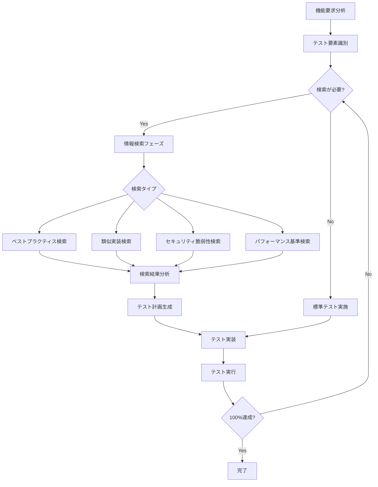

# 機能要求に基づく適応的検索駆動テスト戦略

## 概要
機能要求に応じて、必要なテストケースやベストプラクティスを検索し、動的にテスト戦略を構築する仕組み。

## 検索駆動テストフロー



## 機能別テスト検索マトリックス

### 機能タイプと検索キーワード
```yaml
認証機能:
  必須検索:
    - "authentication testing best practices [使用技術]"
    - "OWASP authentication vulnerabilities"
    - "JWT token testing strategies"
    - "[フレームワーク] authentication test examples"
  
  追加検索（必要に応じて）:
    - "multi-factor authentication testing"
    - "session management test cases"
    - "password policy testing"

決済機能:
  必須検索:
    - "payment processing test scenarios"
    - "PCI DSS compliance testing"
    - "[決済API] integration testing"
    - "financial transaction testing patterns"
  
  追加検索:
    - "currency conversion testing"
    - "payment failure scenarios"
    - "reconciliation testing"

API機能:
  必須検索:
    - "REST API testing checklist"
    - "API rate limiting tests"
    - "API versioning test strategies"
    - "[APIフレームワーク] testing guide"
  
  追加検索:
    - "GraphQL testing patterns"
    - "API contract testing"
    - "API security testing tools"

データ処理機能:
  必須検索:
    - "data validation testing patterns"
    - "ETL testing best practices"
    - "data integrity test cases"
    - "[使用DB] specific test scenarios"
  
  追加検索:
    - "big data testing strategies"
    - "data migration testing"
    - "GDPR compliance testing"
```

## 動的テスト生成テンプレート

### 検索結果からのテスト生成
```yaml
検索実行指示:
  ステップ1_要件分析:
    - 機能の種類を特定
    - 使用技術スタックを確認
    - 規制要件の有無を確認
    
  ステップ2_検索クエリ生成:
    基本クエリ: "[機能] testing best practices [技術スタック] [年]"
    セキュリティ: "[機能] security vulnerabilities testing"
    パフォーマンス: "[機能] performance testing benchmarks"
    エッジケース: "[機能] edge cases testing scenarios"
    
  ステップ3_検索実行:
    - 最新の情報を優先（過去2年以内）
    - 公式ドキュメントを重視
    - 実装例を含む記事を探す
    
  ステップ4_テスト計画作成:
    - 検索結果から重要項目を抽出
    - 機能固有のテストケースを生成
    - 標準テストと組み合わせ
```

### AIへの検索指示例
```markdown
## 検索ベーステスト作成指示

### 機能: [ユーザー認証システム（OAuth2.0）]

以下の手順でテストを作成してください：

1. **情報収集フェーズ**
   ```
   検索1: "OAuth2.0 testing best practices 2024"
   検索2: "OAuth2.0 security vulnerabilities test cases"
   検索3: "[使用ライブラリ] OAuth testing examples"
   検索4: "OAuth token validation testing"
   ```

2. **テストケース抽出**
   検索結果から以下を特定：
   - 必須テストシナリオ
   - よくある脆弱性
   - パフォーマンス基準
   - エッジケース

3. **テスト実装**
   抽出した情報を基に、具体的なテストコードを作成

4. **カバレッジ確認**
   不足があれば追加検索を実施
```

## 機能別テストチェックリスト生成

### 動的チェックリスト生成プロセス
```yaml
プロセス:
  1. 機能タイプ識別:
     input: 機能要求書
     output: 機能カテゴリ（認証/API/データ/UI等）
     
  2. 基本チェックリスト取得:
     source: 標準テストテンプレート
     
  3. 機能固有項目検索:
     query: "[機能] specific test cases"
     filter: 
       - 関連性高
       - 最新情報
       - 実績あり
       
  4. チェックリスト統合:
     - 基本項目
     - 機能固有項目
     - 規制要件項目
     - 技術固有項目
     
  5. 優先順位付け:
     - Critical: セキュリティ、データ整合性
     - High: 主要機能、パフォーマンス
     - Medium: UI/UX、互換性
     - Low: 最適化、追加機能
```

## 検索結果の評価基準

### 情報の信頼性評価
```yaml
信頼性スコアリング:
  高信頼性（採用）:
    - 公式ドキュメント
    - 業界標準（OWASP等）
    - 大手企業の技術ブログ
    - 査読済み論文
    
  中信頼性（参考）:
    - コミュニティブログ
    - Stack Overflow高評価回答
    - GitHubの人気プロジェクト
    
  低信頼性（要検証）:
    - 個人ブログ
    - 古い情報（3年以上前）
    - 未検証のコード例
```

## 実装例：認証機能のテスト

### 検索実行とテスト生成
```markdown
## 認証機能テスト作成プロセス

### 1. 初期分析
機能: JWT認証
技術: Node.js + Express
要件: セキュアなAPI認証

### 2. 検索実行
```bash
# 検索クエリ例
"JWT authentication testing Node.js 2024"
"JWT vulnerabilities test cases"
"Express.js authentication testing best practices"
"OWASP JWT security testing"
```

### 3. 検索結果からの抽出
発見された重要テスト項目:
- トークン有効期限テスト
- 署名検証テスト
- リプレイアタック防止テスト
- クロスサイトリクエストフォージェリ対策テスト

### 4. テストコード生成
```javascript
describe('JWT Authentication Tests', () => {
  // 検索で発見されたベストプラクティスに基づくテスト
  
  test('should reject expired tokens', async () => {
    // 実装
  });
  
  test('should prevent replay attacks', async () => {
    // 実装
  });
  
  test('should validate token signature', async () => {
    // 実装
  });
});
```
```

## 継続的な検索更新

### 定期的な情報更新フロー
```yaml
更新スケジュール:
  毎月:
    - セキュリティ脆弱性の新情報
    - フレームワークのアップデート
    
  四半期:
    - ベストプラクティスの見直し
    - 新しいテストツール調査
    
  年次:
    - テスト戦略全体の見直し
    - 業界標準の更新確認
```

## 検索効率化のためのキャッシュ戦略

### 検索結果のキャッシュ
```yaml
キャッシュポリシー:
  即座にキャッシュ:
    - ベストプラクティス（有効期限: 3ヶ月）
    - 標準テストパターン（有効期限: 6ヶ月）
    
  短期キャッシュ:
    - セキュリティ情報（有効期限: 1週間）
    - バグ情報（有効期限: 1日）
    
  キャッシュしない:
    - 最新の脆弱性情報
    - ホットフィックス情報
```

## 検索駆動テストの自動化

### 自動化スクリプト例
```bash
#!/bin/bash
# search-driven-test.sh

function search_test_patterns() {
  local feature=$1
  local tech_stack=$2
  
  # 基本検索
  echo "Searching for $feature testing patterns..."
  search_queries=(
    "$feature testing best practices $tech_stack"
    "$feature security testing"
    "$feature edge cases"
    "$feature performance benchmarks"
  )
  
  # 検索実行と結果保存
  for query in "${search_queries[@]}"; do
    # AIに検索を依頼
    echo "Query: $query"
    # 結果を解析してテストケースを抽出
  done
}

# 使用例
search_test_patterns "OAuth2.0 authentication" "Node.js Express"
```

## まとめ

この検索駆動テスト戦略により：

1. **最新のベストプラクティス適用**: 常に最新の情報でテスト
2. **機能特化型テスト**: 汎用的でなく機能に最適化
3. **動的な品質保証**: 要件に応じた柔軟なテスト
4. **継続的な改善**: 新しい脅威や手法への対応

機能要求に基づいて必要な情報を検索し、それを基にテストを構築することで、より効果的で包括的なテストが可能になります。