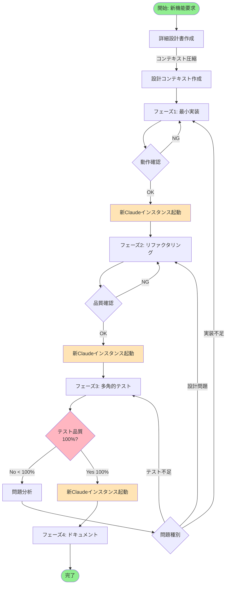
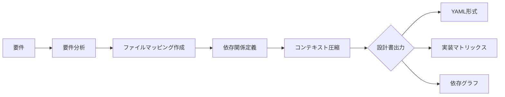
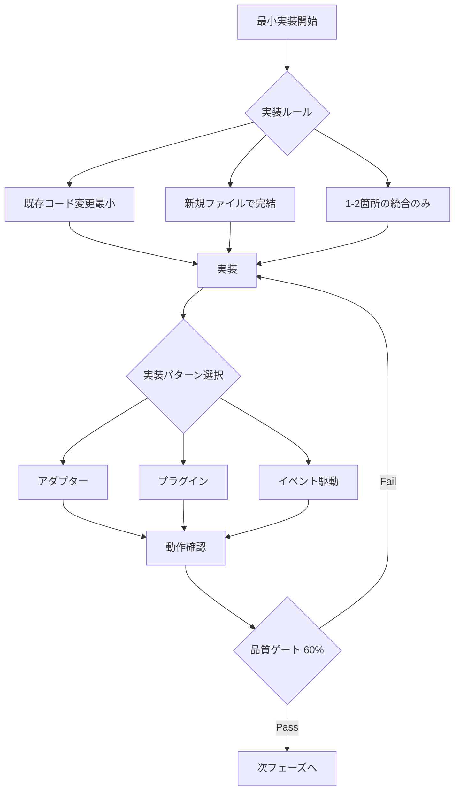
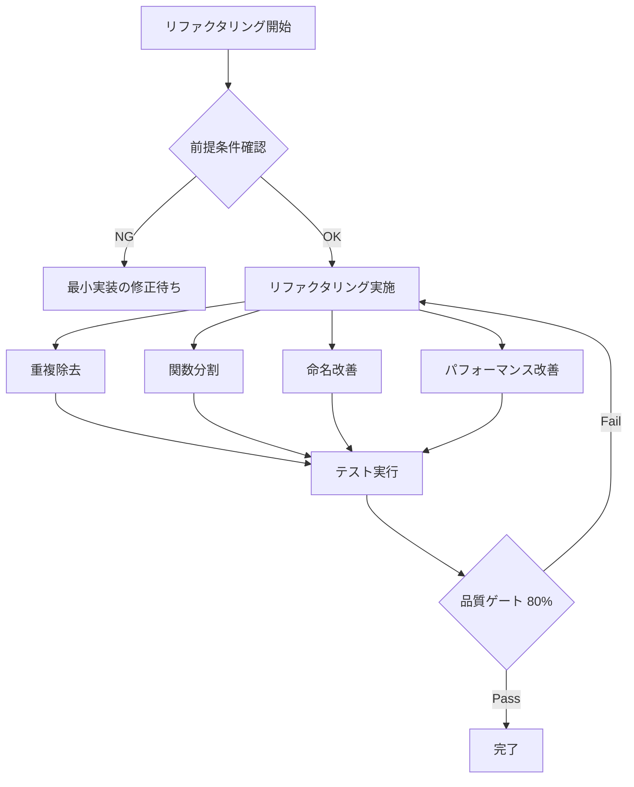
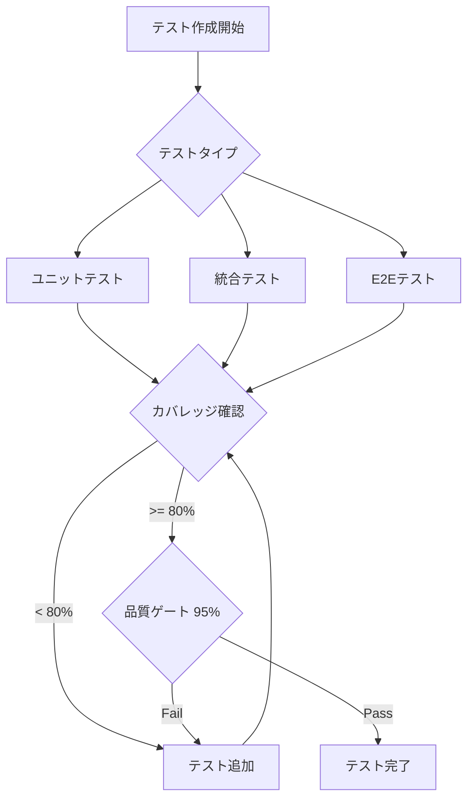
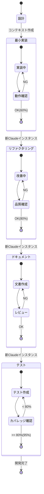
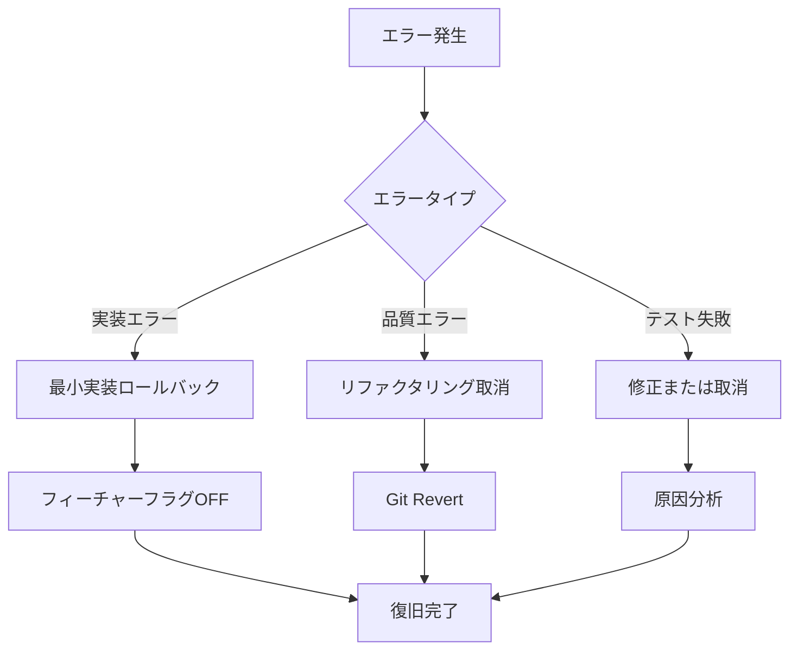
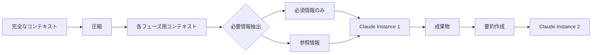
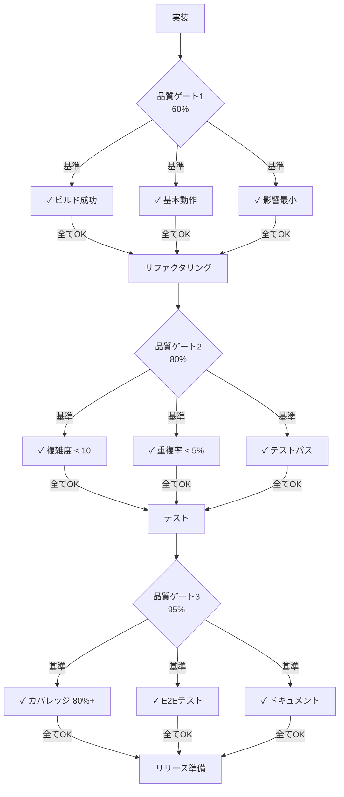
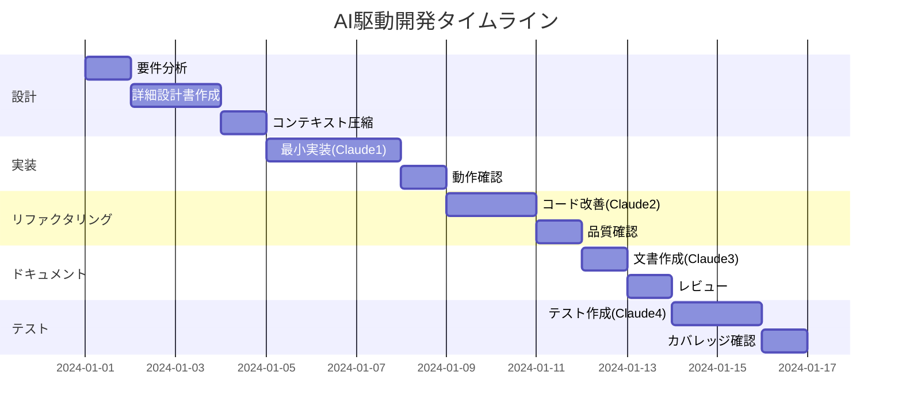

# AI駆動開発フローチャート

## 全体フロー図（改訂版：100%品質達成）

## 詳細設計フェーズ

## 最小実装フェーズ

## リファクタリングフェーズ

## テストフェーズ

## フェーズ間の遷移フロー

## エラー処理とロールバック

## コンテキスト管理フロー

## 品質ゲートの詳細

## 全体の時間軸

## まとめ

このフローチャートは以下を示しています：

1. **4つの独立したClaudeインスタンス**で開発を分割
2. **各フェーズの品質ゲート**で段階的な品質向上
3. **最小限のコンテキスト**で効率的な開発
4. **明確なロールバック手順**でリスク管理

これにより、トークン使用量を最小化しながら、高品質な開発を実現できます。