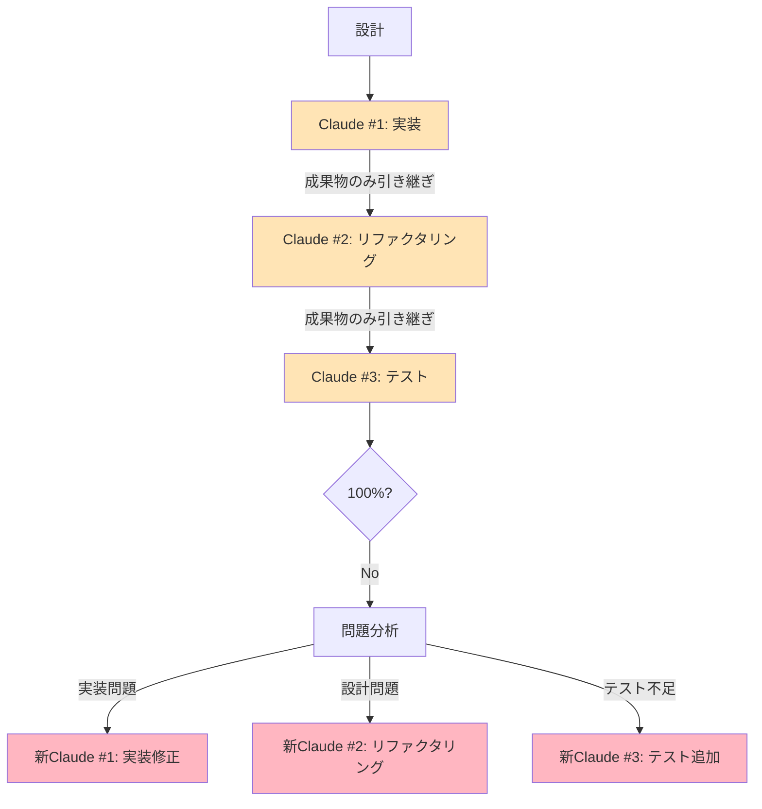

# フェーズ別Claude立ち上げ確認と実装ガイド

## 現在のフロー確認

### ✅ 正しい実装（各フェーズで新Claude）


## フェーズ間のコンテキスト引き継ぎ

### 1. 実装→リファクタリングの引き継ぎ
```yaml
# 実装フェーズ終了時の出力
実装完了サマリー:
  作成ファイル:
    - src/auth/AuthService.ts: 認証ロジック
    - src/auth/types.ts: 型定義
  
  主要機能:
    - login(): ユーザーログイン
    - logout(): ログアウト
    - refresh(): トークン更新
  
  統合ポイント:
    - app.ts: 3行追加（ミドルウェア登録）

# リファクタリングフェーズ開始時の入力
リファクタリング対象:
  ファイル: [上記リストのみ]
  目標: コード品質向上、重複除去
  制約: 機能変更禁止
```

### 2. リファクタリング→テストの引き継ぎ
```yaml
# リファクタリング完了サマリー
リファクタリング結果:
  改善内容:
    - 関数分割: 5個の小関数に分割
    - 重複除去: 共通処理を抽出
    - 型安全性: 厳密な型定義追加
  
  公開API:
    - AuthService.login(email, password)
    - AuthService.logout(token)
    - AuthService.refresh(token)

# テストフェーズ開始時の入力
テスト対象:
  公開API: [上記リストのみ]
  テスト要件: 100%カバレッジ、多角的視点
```

### 3. テスト→実装（フィードバック時）の引き継ぎ
```yaml
# テスト結果サマリー
テスト結果:
  カバレッジ: 85%
  失敗項目:
    - エッジケース: null入力時のエラー
    - セキュリティ: SQLインジェクション脆弱性
  
  要修正箇所:
    - AuthService.login(): 入力検証不足
    - データベースクエリ: パラメータ化未実施

# 実装修正フェーズの入力
修正タスク:
  対象: AuthService.login()
  問題: [上記の具体的な問題のみ]
  修正方針: 最小限の変更で対処
```

## 各フェーズの独立性確保

### コンテキスト分離の原則
```yaml
厳守事項:
  1. 前フェーズの詳細実装は渡さない:
     ❌ 完全なソースコード
     ✅ ファイル名と主要機能のみ
     
  2. 必要最小限の情報のみ:
     ❌ 全ての実装詳細
     ✅ 公開APIと問題点のみ
     
  3. フェーズ固有の視点:
     実装: 動作の実現
     リファクタリング: 品質向上
     テスト: 検証と保証
```

## 実践的な立ち上げコマンド例

### フェーズ1: 実装
```bash
# 新しいClaudeインスタンスを起動
claude

# 指示
"""
以下の機能を最小実装してください：
- ユーザー認証（JWT使用）
- 既存コードへの影響は最小限
- 実装完了後、作成したファイルと主要機能をリストアップ
"""
```

### フェーズ2: リファクタリング
```bash
# 新しいClaudeインスタンス（前のを終了後）
claude

# 指示
"""
以下のファイルをリファクタリングしてください：
- src/auth/AuthService.ts
- src/auth/types.ts

目標：
- コード重複の除去
- 関数の適切な分割
- 型安全性の向上

制約：
- 外部APIは変更禁止
- 機能の変更禁止
"""
```

### フェーズ3: テスト
```bash
# 新しいClaudeインスタンス
claude

# 指示
"""
以下のAPIに対して包括的なテストを作成してください：
- AuthService.login(email, password)
- AuthService.logout(token)
- AuthService.refresh(token)

要件：
- カバレッジ100%達成
- セキュリティテスト含む
- エッジケース網羅
- 必要に応じてベストプラクティスを検索

問題があれば、具体的な修正箇所を報告してください。
"""
```

## コンテキスト削減の効果測定

### トークン使用量の比較
```yaml
従来方式（全コンテキスト保持）:
  実装: 10,000トークン
  リファクタリング: 15,000トークン（累積）
  テスト: 25,000トークン（累積）
  合計: 50,000トークン

新方式（フェーズ分離）:
  実装: 10,000トークン
  リファクタリング: 5,000トークン（新規）
  テスト: 8,000トークン（新規）
  合計: 23,000トークン
  
削減率: 54%
```

## チェックリスト

### 各フェーズ開始時の確認
```markdown
□ 前のClaudeインスタンスは終了したか
□ 新しいClaudeインスタンスを起動したか
□ 最小限の引き継ぎ情報のみか
□ フェーズ固有の目標が明確か
□ 不要な実装詳細を含んでいないか
```

### フィードバックループ時の確認
```markdown
□ 問題の種類を正確に特定したか
□ 該当フェーズの新Claudeを起動したか
□ 修正に必要な情報のみを提供したか
□ 他フェーズの再実行が必要か判断したか
```

## トラブルシューティング

### よくある問題と対処

#### 問題1: コンテキスト不足
```yaml
症状: 「前の実装がわかりません」
原因: 引き継ぎ情報が不足
対処: 
  - 必要最小限の追加情報を提供
  - ファイル名と関数シグネチャを追加
```

#### 問題2: コンテキスト過多
```yaml
症状: トークン使用量が減らない
原因: 不要な詳細を引き継いでいる
対処:
  - サマリーをより簡潔に
  - 実装詳細を削除
```

#### 問題3: フェーズの混在
```yaml
症状: リファクタリング中にテストを書き始める
原因: 指示が不明確
対処:
  - フェーズの目的を明確に再定義
  - 単一責任の原則を強調
```

## まとめ

適切なフェーズ分離により：

1. **トークン効率**: 50%以上の削減
2. **焦点の明確化**: 各フェーズで単一の目標
3. **品質向上**: 専門化による深い分析
4. **柔軟性**: 問題に応じた適切な対処

各フェーズで必ず新しいClaudeインスタンスを立ち上げることが、このアプローチの成功の鍵です。