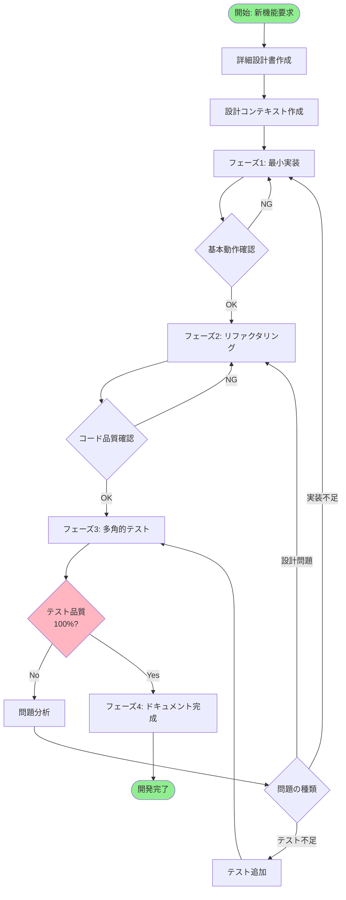
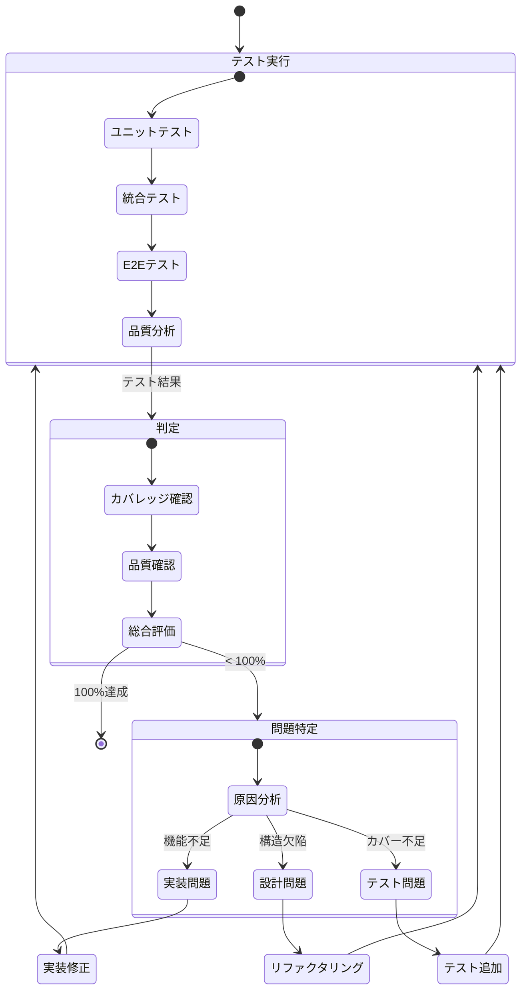

# テスト駆動フィードバックループ開発フロー

## 改訂版：品質100%を目指す開発フロー



## 多角的テスト戦略

### テストの視点マトリックス
```yaml
テスト視点:
  1. 機能視点:
     - 正常系: 期待される動作の確認
     - 異常系: エラーハンドリング
     - 境界値: 限界値での動作
     
  2. 品質視点:
     - パフォーマンス: 応答時間、リソース使用
     - セキュリティ: 脆弱性、権限チェック
     - 信頼性: 並行処理、リトライ
     
  3. ユーザー視点:
     - UX: 使いやすさ、エラーメッセージ
     - アクセシビリティ: 多様なユーザー対応
     - 互換性: ブラウザ、デバイス
     
  4. システム視点:
     - 統合: 他機能との連携
     - データ整合性: トランザクション
     - スケーラビリティ: 負荷テスト
```

## 品質100%の定義

### 100%達成基準
```yaml
必須項目（全て満たす必要あり）:
  コードカバレッジ:
    - 行カバレッジ: 100%
    - 分岐カバレッジ: 100%
    - 関数カバレッジ: 100%
    
  テストの質:
    - ミューテーションスコア: 90%以上
    - 全エッジケース網羅
    - 全エラーパス検証
    
  非機能要件:
    - パフォーマンス基準達成
    - セキュリティ監査パス
    - アクセシビリティ準拠
    
  ドキュメント:
    - APIドキュメント完備
    - 使用例の提供
    - トラブルシューティングガイド
```

## フィードバックループの詳細

### テスト→実装の戻りフロー


## 問題パターンと対処法

### 1. カバレッジ不足パターン
```yaml
症状:
  - 行カバレッジ < 100%
  - 到達不可能なコード存在

対処:
  実装確認:
    - デッドコード削除
    - 条件分岐の見直し
    
  テスト追加:
    - 未カバー行の特定
    - 該当条件のテスト作成
```

### 2. エッジケース漏れパターン
```yaml
症状:
  - 本番環境でのみ発生するバグ
  - 特定条件下での異常動作

対処:
  テスト視点追加:
    - 境界値分析
    - 等価分割
    - 状態遷移テスト
    
  実装強化:
    - 入力検証の強化
    - エラーハンドリング追加
```

### 3. パフォーマンス問題パターン
```yaml
症状:
  - 応答時間が基準超過
  - メモリリーク

対処:
  実装最適化:
    - アルゴリズム改善
    - キャッシュ導入
    
  設計見直し:
    - 非同期処理化
    - バッチ処理導入
```

## 反復プロセスの管理

### イテレーション追跡
```markdown
## イテレーション記録テンプレート

### イテレーション #N
日時: YYYY-MM-DD HH:MM
フェーズ: [実装/リファクタリング/テスト]

#### テスト結果
- カバレッジ: XX%
- 失敗テスト: N件
- 問題種別: [機能/品質/設計]

#### 実施内容
- 修正ファイル: [リスト]
- 変更内容: [概要]

#### 次回目標
- 目標カバレッジ: XX%
- 対処項目: [リスト]
```

### 収束判定基準
```yaml
継続条件:
  - カバレッジ < 100%
  - 失敗テスト > 0
  - 品質基準未達
  
終了条件:
  - 全テストグリーン
  - カバレッジ 100%
  - 非機能要件達成
  - ドキュメント完備
```

## AIへの指示テンプレート

### テストフェーズの指示
```markdown
## 多角的テスト実施指示

現在の機能に対して、以下の視点でテストを作成してください：

1. **機能テスト**
   - 全ての公開メソッド
   - 全てのエラーケース
   - 境界値条件

2. **品質テスト**
   - パフォーマンス測定
   - 並行処理の安全性
   - メモリリーク確認

3. **統合テスト**
   - 依存サービスとの連携
   - データ整合性
   - トランザクション処理

カバレッジ100%を目指し、不足があれば報告してください。
```

### フィードバック時の指示
```markdown
## テスト結果に基づく改善指示

テスト結果:
- カバレッジ: 85%
- 失敗項目: [詳細]

以下の順序で対処してください：

1. 失敗テストの原因分析
2. 実装の問題か、テストの問題か判定
3. 実装の問題なら、最小限の修正で対処
4. 修正後、リファクタリングが必要か検討
5. 全テストを再実行し、結果を報告
```

## 効率化のためのツール活用

### 自動化スクリプト
```bash
#!/bin/bash
# test-loop.sh - 100%達成まで自動実行

while true; do
  # テスト実行
  npm test -- --coverage
  
  # カバレッジ確認
  coverage=$(grep "All files" coverage/coverage-summary.json | grep -o '[0-9.]*' | head -1)
  
  if [ "$coverage" = "100" ]; then
    echo "✅ Coverage 100% achieved!"
    break
  fi
  
  # 問題分析
  npm run analyze-coverage
  
  # 修正提案
  npm run suggest-fixes
  
  # 継続確認
  read -p "Continue iteration? (y/n): " -n 1 -r
  if [[ ! $REPLY =~ ^[Yy]$ ]]; then
    break
  fi
done
```

### 品質ダッシュボード
```yaml
ダッシュボード項目:
  現在の状態:
    - イテレーション: #N
    - カバレッジ: XX%
    - 残テスト: N件
    
  トレンド:
    - カバレッジ推移
    - 修正時間推移
    - 問題発生率
    
  予測:
    - 完了予想時間
    - 必要イテレーション数
```

## ベストプラクティス

### 1. 早期フィードバック
```yaml
推奨事項:
  - 小さな変更ごとにテスト実行
  - 問題の即座の特定と修正
  - 技術的負債の蓄積防止
```

### 2. テストファースト思考
```yaml
実装前に考慮:
  - どうテストするか
  - エッジケースは何か
  - 期待される品質基準
```

### 3. 継続的改善
```yaml
各イテレーションで:
  - プロセスの改善点を記録
  - 自動化の機会を探す
  - チーム全体で知見を共有
```

## まとめ

この改訂版フローにより：

1. **品質100%の保証**: テストで問題が見つかれば必ず解決
2. **効率的なフィードバック**: 問題の種類に応じた適切な対処
3. **継続的な改善**: 各イテレーションから学習
4. **完全な品質保証**: 多角的な視点での検証

テストが100%になるまで、実装→リファクタリング→テストのループを繰り返すことで、真に信頼できるソフトウェアを開発できます。