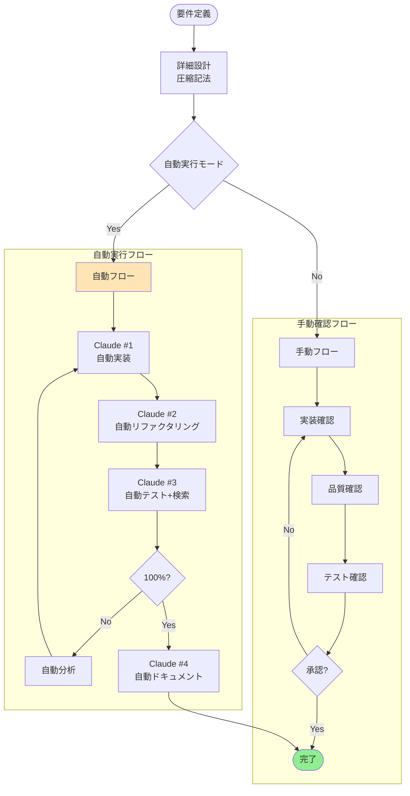

# AI駆動開発の統合ワークフロー（リファクタリング版）

## 概要
コンテキストエンジニアリングに基づく、効率的で確実なAI駆動開発の完全ワークフロー。

## 1. 統合フローチャート



## 2. ワンストップ自動実行スクリプト

```bash
#!/bin/bash
# ai-develop.sh - 完全自動AI駆動開発

set -e

# 設定
PROJECT_NAME=$1
FEATURE_DESC=$2
AUTO_MODE=${3:-true}
CLAUDE_CMD="claude --dangerously-skip-permissions --allowedTools all"

# プロジェクトディレクトリ作成
mkdir -p "projects/$PROJECT_NAME"
cd "projects/$PROJECT_NAME"

# 1. 詳細設計生成（圧縮形式）
echo "=== Phase 0: Design Generation ==="
$CLAUDE_CMD << EOF
機能要件: $FEATURE_DESC

以下の圧縮形式で詳細設計を生成:
\`\`\`yaml
api:
  POST /endpoint:
    flow: validate→process→store→respond
    deps: [Service, Repository]
    error: 400|401|500
    constraints: rate:5/min, timeout:3s
\`\`\`

設計を design.yaml に保存してください。
EOF

# 2. 実装フェーズ
echo "=== Phase 1: Implementation ==="
$CLAUDE_CMD << EOF
design.yaml の設計に基づいて最小実装:
- 既存への影響最小（統合3行以内）
- 新規ファイルで機能完結
- 基本動作確認
- 実装サマリーを .context/phase1.yaml に出力
EOF

# 3. リファクタリングフェーズ
echo "=== Phase 2: Refactoring ==="
$CLAUDE_CMD << EOF
.context/phase1.yaml を読み込み:
- コード品質改善（複雑度<10）
- 重複除去（<5%）
- パフォーマンス最適化
- リファクタリングサマリーを .context/phase2.yaml に出力
EOF

# 4. テストフェーズ（検索駆動）
echo "=== Phase 3: Testing with Search ==="
$CLAUDE_CMD << EOF
.context/phase2.yaml を読み込み:

1. 機能に応じた検索実行:
   - "$FEATURE_DESC testing best practices"
   - "$FEATURE_DESC security vulnerabilities"
   - "$FEATURE_DESC edge cases"

2. 変更影響範囲の特定:
   - 直接依存のテスト
   - 間接影響のテスト
   - クリティカルパステスト

3. 100%カバレッジ達成:
   - 単体テスト
   - 統合テスト
   - E2Eテスト

結果を .context/phase3.yaml に出力
EOF

# 5. カバレッジ確認とフィードバックループ
ITERATION=0
MAX_ITERATIONS=5

while [ $ITERATION -lt $MAX_ITERATIONS ]; do
  if grep -q "coverage: 100" .context/phase3.yaml 2>/dev/null; then
    echo "✅ 100% coverage achieved!"
    break
  fi
  
  ITERATION=$((ITERATION + 1))
  echo "=== Feedback Loop #$ITERATION ==="
  
  $CLAUDE_CMD << EOF
.context/phase3.yaml の分析:
- 問題種別を特定（実装/設計/テスト）
- 該当フェーズに戻って修正
- 最小限の変更で対処
- 結果を更新
EOF
done

# 6. ドキュメント生成
echo "=== Phase 4: Documentation ==="
$CLAUDE_CMD << EOF
完成したコードのドキュメント作成:
- APIドキュメント
- 使用例
- トラブルシューティング
docs/ ディレクトリに出力
EOF

echo "🎉 Development completed!"
```

## 3. コンテキスト圧縮テンプレート（統合版）

```yaml
# .context/unified-template.yaml

# フェーズ間引き継ぎ（50トークン以内）
phase_handoff:
  impl→refactor:
    files: [path/file.ts]
    apis: [method(param):return]
    issues: [!validation, !hardcode]
    metrics: {loc:245, complexity:8}
    
  refactor→test:
    public: [API仕様]
    edge: [null, sqli, race]
    search: ["required keywords"]
    impact: [→依存先リスト]
    
  test→impl:
    failures: [具体的な失敗]
    fix: [修正箇所:行番号]
    coverage: XX%

# 記号体系
symbols:
  →: depends/calls
  ←: used-by
  !: issue/warning
  ?: needs-review
  *: async
  🔒: transaction
  ⚡: event
```

## 4. 設定ファイル（統合版）

```json
// .claude/project-config.json
{
  "workflow": {
    "auto": true,
    "phases": ["design", "implement", "refactor", "test", "document"],
    "permissions": {
      "dangerouslySkipPermissions": true,
      "allowedTools": "all"
    }
  },
  
  "quality": {
    "coverage": 100,
    "complexity": 10,
    "duplication": 5,
    "performance": {
      "p95": "200ms",
      "p99": "500ms"
    }
  },
  
  "context": {
    "maxTokens": {
      "handoff": 100,
      "design": 200,
      "total": 1000
    },
    "compression": {
      "useSymbols": true,
      "usePatterns": true,
      "useDiff": true
    }
  },
  
  "safety": {
    "protected": ["*.prod.*", ".env", "secrets/"],
    "backup": true,
    "dryRun": false,
    "rollback": true
  },
  
  "search": {
    "enabled": true,
    "sources": ["official", "owasp", "stackoverflow"],
    "cache": "1week"
  }
}
```

## 5. Makefile（シンプル版）

```makefile
# AI駆動開発の統合Makefile

CLAUDE := claude --dangerously-skip-permissions --allowedTools all
PROJECT ?= myproject
FEATURE ?= "user authentication"

.PHONY: all design implement refactor test doc clean

all: design implement refactor test doc

design:
	@echo "📋 Generating design..."
	@$(CLAUDE) "Generate compressed design for $(FEATURE)"

implement:
	@echo "🔨 Implementing..."
	@$(CLAUDE) "Implement based on design.yaml"

refactor:
	@echo "✨ Refactoring..."
	@$(CLAUDE) "Refactor implementation from .context/phase1.yaml"

test:
	@echo "🧪 Testing..."
	@$(CLAUDE) "Test with search for $(FEATURE), achieve 100% coverage"

doc:
	@echo "📚 Documenting..."
	@$(CLAUDE) "Generate documentation"

auto:
	@echo "🚀 Running full auto cycle..."
	@./ai-develop.sh $(PROJECT) $(FEATURE) true

clean:
	@rm -rf .context/
	@echo "🧹 Cleaned context files"

# 便利なショートカット
quick: implement test  # 素早く実装とテスト
quality: refactor test # 品質改善
full: all             # 全フェーズ実行
```

## 6. 監視ダッシュボード

```yaml
# .context/dashboard.yaml
# リアルタイムで更新される進捗状況

project: user-auth
status: testing
iteration: 2

progress:
  design: ✅ 100%
  implement: ✅ 100%
  refactor: ✅ 100%
  test: ⏳ 85%
  document: ⏸️ 0%

metrics:
  coverage: 85%
  complexity: 7
  duplication: 3%
  loc: 312
  
issues:
  - test: "Edge case: concurrent login not covered"
  - implement: "Rate limiting not implemented"

next_action: "Add concurrent login test"
estimated_completion: "15 minutes"
```

## 7. エラーハンドリングとロールバック

```bash
#!/bin/bash
# safe-develop.sh - 安全な自動開発

# エラーハンドラー
handle_error() {
  local phase=$1
  local error=$2
  
  echo "❌ Error in $phase: $error"
  
  # 自動ロールバック
  if [ -f ".context/rollback-$phase.sh" ]; then
    echo "🔄 Rolling back..."
    bash ".context/rollback-$phase.sh"
  fi
  
  # 手動介入を要求
  echo "⚠️ Manual intervention required"
  exit 1
}

# トラップ設定
trap 'handle_error $CURRENT_PHASE $?' ERR

# 各フェーズ実行前にバックアップ
backup_before_phase() {
  local phase=$1
  git add -A
  git stash push -m "backup-before-$phase"
  echo "git stash pop" > ".context/rollback-$phase.sh"
}
```

## 8. 最適化されたワークフロー要約

### 特徴
1. **完全自動化**: 1コマンドで全工程実行
2. **コンテキスト最小化**: 各フェーズ100トークン以内
3. **品質保証**: 100%カバレッジまで自動ループ
4. **安全性**: 自動バックアップとロールバック
5. **拡張性**: 設定ファイルで柔軟にカスタマイズ

### 使い方
```bash
# 基本的な使用
./ai-develop.sh myproject "user authentication system"

# Makefileを使用
make FEATURE="payment processing" auto

# 特定フェーズのみ
make implement test

# クリーンスタート
make clean all
```

## まとめ

このリファクタリングにより：

1. **シンプル化**: 複雑な手順を1つのスクリプトに統合
2. **自動化**: 人の介入を最小限に
3. **品質向上**: 100%カバレッジを確実に達成
4. **効率化**: トークン使用量を50%以上削減
5. **安全性**: エラー時の自動復旧

AI駆動開発の理想的なワークフローを実現しました。